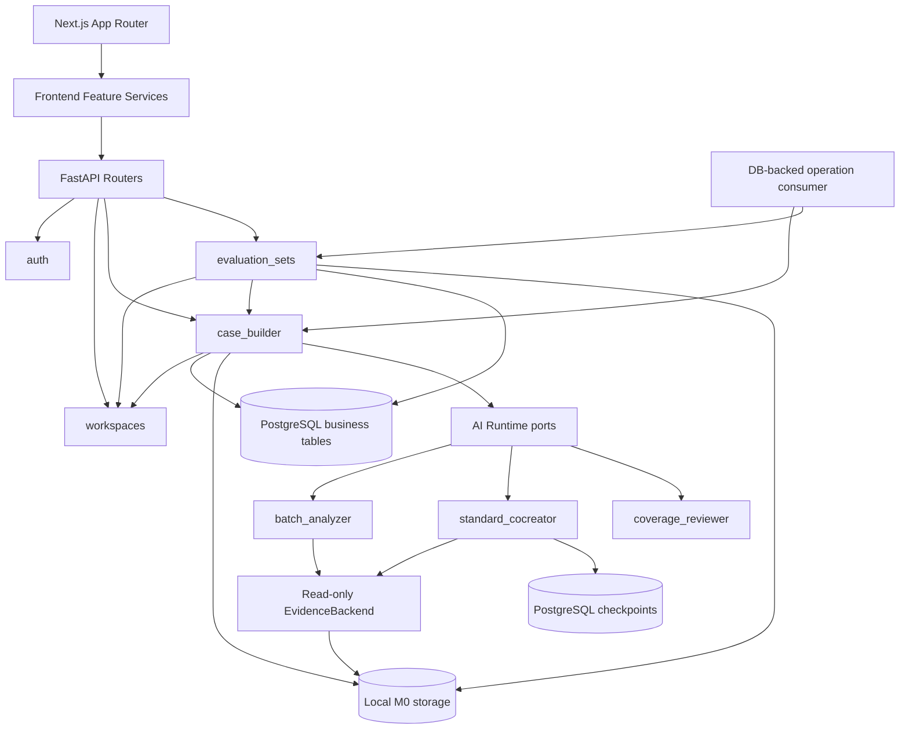

# M0 主观评测集技术与交互设计

## 1. Design Outcome

M0 将当前“单文件 → Stub 草稿 → 候选题”的 Walking Skeleton 升级为一条可持久化、可回查、可冻结的主观文案评测集闭环：

```text
创建场景
→ 上传异构证据批次
→ 后台只读 Deep Agent 分析
→ 老师确认任务边界与文件角色
→ 场景评测合同共创
→ 单题判定依据共创与定稿
→ 加入下一版本草稿
→ 冻结不可变版本
→ 生成 runtime / judge / provenance 三视图版本包
```

M0 只证明主观文案/新闻稿标准共创成立。知识库、在线运行被测 Skill Agent、客观 Judge 和评测报告分别属于 M1/M2 或后续范围。

## 2. First-Principles Boundaries

### 2.1 权威分层

| 层 | 负责 | 不负责 |
|---|---|---|
| 老师 | 确认任务边界、文件角色、场景标准、题、风险与冻结 | 选择模型、理解框架、维护技术配置 |
| Deep Agent | 只读证据理解、语义矛盾、候选变更、下一问、覆盖建议 | 权限、状态迁移、自动定稿、自动冻结、执行上传代码 |
| 确定性规则 | 安全解包、Schema、证据引用、完整性、幂等、版本与可见性门禁 | 主观写作判断 |
| FastAPI + PostgreSQL 业务表 | 业务事实、授权、事务、revision、确认、版本、审计和后台任务 | 保存或解释 Graph 私有执行游标 |
| PostgreSQL Checkpointer | `standard_cocreator` 的 thread 级消息、工具调用配对、临时文件、pending interrupt、Checkpoint 历史和恢复游标 | 场景合同、题、评测集版本、权限或审计事实源 |

### 2.2 动态与静态

- 动态：AI 的阅读顺序、追问路径、候选规则和影响建议。
- 静态：老师定稿的题、确认的场景合同修订、冻结评测集版本和版本包。
- 任何冻结后新判断只能进入下一修订或下一版本，不回写历史。

## 3. System Architecture



### 3.1 Feature ownership

- `auth`：延续当前账号与 Session 边界，改为持久化 Repository。
- `workspaces`：场景身份、名称、说明、所有者；不拥有题和评测集内容。
- `case_builder`：上传批次、文件清单、后台分析、任务分组、任务包、共创会话、题修订、批注与标准升级提案。
- `evaluation_sets`：场景合同修订、唯一下一版本草稿、成员关系、影响审查、冻结版本、版本包与下载。
- `app/lib/operations`：OperationJob、AgentRunAttempt、租约/重试/幂等和单消费者；只调度，不拥有目标 Feature 的业务转换。
- `app/lib` 其他模块：数据库会话、存储适配器、Deep Agents Profile 配置等真正跨 Feature 的基础能力。

跨 Feature 只调用对方 Service，不直接读取 Repository。

### 3.2 Persistence

M0 需要 PostgreSQL、迁移和真实文件存储；当前进程内 `dict` Stub 不再能够满足跨重启、后台任务和不可变历史要求。

- PostgreSQL 保存业务记录、状态、审计和后台任务租约。
- 同一 PostgreSQL 集群可以同时承载业务表和 LangGraph Checkpoint 表，但两者使用独立迁移与逻辑所有权。业务 Service 不直接读写 Checkpoint 内部表；AI Adapter 通过 Checkpointer API 访问。
- `standard_cocreator` 使用生产级异步 PostgreSQL Checkpointer；Checkpoint 使用加密 serializer。服务端在业务会话中只保存 thread/checkpoint 映射和兼容版本，不复制 Checkpoint payload。
- Checkpointer 不是任务队列。`OperationJob` 继续拥有排队、租约、并发、显式重试、`202` 页面状态和迟到结果处理。
- 文件存储 M0 使用服务端生成键的本地目录，至少分 `uploads/`、`evidence/`、`versions/` 和 `staging/`。
- 数据库只保存存储键、哈希和元数据，不保存或返回宿主绝对路径。
- 文件内容按 SHA-256 去重可以作为存储实现细节，但业务记录不能因去重共享授权边界。

## 4. Domain Model

### 4.1 Cross-cutting operations

| Entity | Key fields | Invariant |
|---|---|---|
| `OperationJob` | kind, target_type/id/revision, state, attempt, lease, command_id, profile_version, result_hash, error | 同一 target/revision/command 最多一个有效运行；提交时 CAS revision，不允许迟到结果覆盖新状态 |
| `AgentRunAttempt` | operation, run_id, thread_id, base/produced_checkpoint_id, profile/graph version, state, model/tool/transport counts, token/cost, result_hash, error, started/ended_at | 每次业务 retry 新建；只保存恢复指针和指标，不复制 Checkpoint 正文、私有 reasoning 或完整 tool trace |

它们由 `app/lib/operations` 拥有。Job handler 只能调用目标 Feature Service；业务状态提交仍在目标 Feature 的事务内完成。

### 4.2 Ingestion and evidence

| Entity | Key fields | Invariant |
|---|---|---|
| `UploadBatch` | workspace, uploader, state, created_at | 一次上传，可产生 0..N 个任务包 |
| `EvidenceFile` | batch, original_name, storage_key, sha256, media_type, bytes, parse_state | 每个文件有独立、可审计解析状态 |
| `FileDisposition` | file, proposed_role, confirmed_role, required/ignored, reason, visibility | 未确认角色或必需失败文件阻塞后续 |
| `TaskGroupProposal` | batch, revision, groups, evidence_refs | Deep Agent 提议，老师确认前不是业务事实 |
| `TaskPackage` | workspace, batch, confirmed group, goal, status | 一个真实任务，包含 1..N 次尝试证据 |
| `SkillRunEvidence` | task_package, source event/file, sequence, outcome role | 同一任务的多次调用不拆成重复题 |

M0 初始允许的上传类型以真实样本为准：`.md`、`.txt`、`.json`、`.jsonl` 和 `.zip`；ZIP 内部使用相同白名单。新增 PDF、音视频或办公文档必须有真实样本与解析验收后再扩展。

### 4.3 Co-creation and standards

| Entity | Key fields | Invariant |
|---|---|---|
| `CoCreationSession` | target_type/id, stable thread_id, accepted_checkpoint_id, pending_interrupt_id, business_revision, ai_profile_version, graph_schema_version, state, current_turn_id | 业务表决定哪个 Checkpoint 分支被接受；同一 session 最多一个活动 resume |
| `CoCreationTurn` | question, reason, answer, answer_command_id, question_checkpoint_id, delta, evidence_refs, state, profile_version | 一轮只允许一个待答问题；答案先持久化，再恢复对应 Checkpoint；回答与结果提交分别幂等 |
| `ScenarioContractRevision` | workspace, revision, content, status, confirmed_by/at | 每场景当前只有一个已确认合同修订 |
| `QuestionRevision` | task_package, contract_revision, content, status, confirmed_by/at | 定稿后只读；修改产生新修订 |
| `TeacherFeedback` | question_revision, source, text, scope | 默认 `question_only` |
| `StandardPromotionProposal` | feedback, proposed_rule, rationale, impacted_questions, decision | 只有老师批准才创建合同新修订 |

`QuestionRevision.content` 的主观判定依据至少覆盖：任务目标、允许输入、输出要求、事实与表达硬门禁、参考结果或多版结果、认可/否定原因、最低可用质量线、主要保护能力、题内补充规则、阻塞与非阻塞缺口。

### 4.4 Evaluation set lineage

| Entity | Key fields | Invariant |
|---|---|---|
| `WorkingSetDraft` | workspace, base_version, contract_revision, status | 每个场景最多一个 |
| `WorkingSetMember` | draft, question_revision, active | 加入草稿才影响下一正式版本 |
| `ContractImpactReview` | contract_revision, question_revision, rule_result, ai_advice, teacher_decision | AI 无权解除待复核 |
| `CoverageSnapshot` | draft/version, dimensions, capabilities, gaps, duplicates, acknowledged | 覆盖不足默认警告，不是数量门禁 |
| `EvaluationSetVersion` | workspace, version, manifest_sha256, package_key, frozen_by/at | 冻结后不可变，版本连续递增 |

## 5. State Machines

### 5.1 Upload batch

```text
accepted
→ queued
→ inspecting
→ analyzing
→ awaiting_group_confirmation
→ grouped

queued|inspecting|analyzing → analysis_failed → queued (explicit retry)
```

- GET 与前端轮询只读取，不推进状态。上传批次状态由对应 `OperationJob(kind=batch_analysis)` 成功提交后推进。
- 过期任务租约在启动和新 claim 前回收；同一 target/revision/command id 不创建第二任务。
- 不展示伪百分比，只展示真实阶段和最近更新时间。

### 5.2 Co-creation

```text
drafting
→ queued
→ running
→ awaiting_answer
→ answer_accepted
→ resume_queued
→ resuming
→ awaiting_answer
→ ready_for_review
→ confirmed

queued|running|resume_queued|resuming → ai_failed → queued|resume_queued
running|resuming → projection_pending → awaiting_answer|ready_for_review
queued|running|resume_queued|resuming → superseded
```

- Deep Agent 可以建议 `ready_for_review`，确定性完整性门决定该建议是否可用。
- 老师主动进入最终审阅并确认；AI 不能进入 `confirmed`。
- 首次共创使用普通 Agent 输入启动稳定 thread；问题通过 `ask_teacher` 中断或完成式问答边界形成。Adapter 只有在 Checkpoint 已持久化且中断 payload 通过验证后，才把状态投影为 `awaiting_answer`。
- 回答命令先校验 `turn_id + business_revision + accepted_checkpoint_id`，幂等保存答案和 `OperationJob(kind=cocreation_resume)` 后返回 `202`，不在 HTTP 请求里执行 `Command(resume=...)`。
- Worker 从业务表记录的 `accepted_checkpoint_id` 恢复，而不是默认使用 thread 最新 Checkpoint。ask-user 模式使用 `Command(resume={decisions:[{type:"respond", message: answer}]})`；完成式问答模式向同一 thread 追加 HumanMessage。
- Adapter 接到下一个 interrupt 或最终 structured response 后，记录 `produced_checkpoint_id` 和验证后的业务投影。业务事务用 revision CAS 写入 delta/receipt/下一问，并把 `accepted_checkpoint_id` 推进到 produced Checkpoint。
- Graph 已推进而业务事务失败时，OperationJob 进入 `projection_pending`；恢复流程通过 `graph.get_state`/Checkpointer read API 读取 `produced_checkpoint_id` 的 StateSnapshot，重新生成并提交相同投影。禁止使用 `invoke(None)`、checkpoint replay 或任何会再次执行模型/工具的方式“重投影”。
- 回答重试用 turn/revision/command id 幂等；不同答案对已回答 turn 返回冲突。若业务 revision、已接受 Checkpoint 或兼容版本已变化，旧操作标记 `superseded`，不提交迟到结果。

### 5.3 Evaluation set

```text
no_version → working_draft → freezing → v1
v1 → next_working_draft → freezing → v2
```

- 冻结命令保存冻结意图和 `OperationJob(kind=freeze_package)` 后返回 `202`。`freezing` 先构建 staging 包和校验值，成功后事务写入正式版本并移动/发布不可变包。
- 文件发布与数据库提交不能形成真正跨介质原子事务，因此使用 staging + content hash + ready marker；任何失败不创建可见版本，后台清理遗留 staging。
- 场景合同变化会标记受影响题 `review_required`，未复核题不能进入 freezing。

## 6. Deep Agents Runtime

### 6.1 Ports and agent instances

业务 Service 依赖三个小端口；生产适配器都使用 Deep Agents，测试适配器使用 Fake：

```python
class EvidenceAnalyzer(Protocol):
    async def analyze_batch(...) -> BatchAnalysis: ...

class StandardCoCreator(Protocol):
    async def start(...) -> CoCreationBoundary: ...
    async def resume(...) -> CoCreationBoundary: ...
    async def reproject(...) -> CoCreationBoundary: ...

class CoverageReviewer(Protocol):
    async def review(...) -> CoverageReview: ...
```

对应三个命名 Agent：`batch_analyzer`、`standard_cocreator`、`coverage_reviewer`。它们共享模型 adapter 和顶层 AI Profile 版本，但拥有不同静态系统提示词、小型 `response_format` 与最小工具面，相互之间没有 subagent/task 调用。

- `batch_analyzer`：只读当前 UploadBatch 的 canonical evidence view。
- `standard_cocreator`：只读当前 TaskPackage 的 canonical evidence view，不看同场景其他未授权任务；一个业务 session 对应一个稳定 Checkpointer thread。
- `coverage_reviewer`：只接收已确认合同与题的结构化快照，不暴露任何文件工具。

拆分理由：批次分组、单轮追问和覆盖审查是三种不同输出合同。把它们塞进一个大型 union Schema 会提高缺字段、无效 tool call 和 Provider 兼容失败概率。

### 6.2 Verified configuration shape

以下配置形状已经由 `research/prestart-spike-results.md` 对锁定版本完成实跑；实现仍需通过 Adapter 工厂封装私有兼容点，不能把示意代码散落到 Feature：

```python
from dataclasses import dataclass

from deepagents import (
    FilesystemPermission,
    HarnessProfile,
    create_deep_agent,
    register_harness_profile,
)
from deepagents.backends import StateBackend
from deepagents.middleware.filesystem import FilesystemMiddleware
from deepagents.profiles import GeneralPurposeSubagentProfile
from langchain.agents.middleware import (
    ModelCallLimitMiddleware,
    ModelRetryMiddleware,
    ToolCallLimitMiddleware,
)
from langchain.agents.structured_output import ToolStrategy
from langgraph.checkpoint.postgres.aio import AsyncPostgresSaver
from langgraph.checkpoint.serde.encrypted import EncryptedSerializer

register_harness_profile(
    EXACT_MODEL_KEY,
    HarnessProfile(
        excluded_tools=frozenset({
            "task", "write_todos", "execute", "write_file", "edit_file", "delete"
        }),
        general_purpose_subagent=GeneralPurposeSubagentProfile(enabled=False),
    ),
)

@dataclass(frozen=True)
class AgentRunContext:
    run_id: str
    workspace_id: str
    target_id: str
    evidence_scope: str
    business_revision: int
    ai_profile_version: str
    graph_schema_version: str
    deadline_at: str

backend = EvidenceBackend()

permissions = [
    FilesystemPermission(
        operations=["read"], paths=["/evidence/**"], mode="allow"
    ),
    FilesystemPermission(
        operations=["read"], paths=["/**"], mode="deny"
    ),
    FilesystemPermission(
        operations=["write"], paths=["/**"], mode="deny"
    ),
]

filesystem = FilesystemMiddleware(
    backend=backend,
    tools=["read_file", "ls", "glob", "grep"],
    # deepagents==0.7.11 的锁定签名；由 Adapter 工厂集中断言和封装。
    _permissions=permissions,
)

batch_analyzer = create_deep_agent(
    name="batch_analyzer",
    model=profile_model,
    middleware=[
        filesystem,
        ModelToolSurfaceMiddleware({
            "read_file", "ls", "glob", "grep", "BatchAnalysis"
        }),
        ModelCallLimitMiddleware(run_limit=profile_model_call_limit),
        ToolCallLimitMiddleware(run_limit=profile_tool_call_limit),
        ModelRetryMiddleware(max_retries=profile_model_retries),
    ],
    permissions=permissions,
    context_schema=AgentRunContext,
    response_format=ToolStrategy(BatchAnalysis),
)

# 由 FastAPI/Worker lifespan 持有整个 context manager 生命周期；
# setup 是部署迁移，不在请求内执行。
checkpoint_serde = EncryptedSerializer.from_pycryptodome_aes()
async with AsyncPostgresSaver.from_conn_string(
    CHECKPOINT_DATABASE_URL,
    serde=checkpoint_serde,
) as checkpointer:
    standard_cocreator = create_deep_agent(
        name="standard_cocreator",
        model=profile_model,
        tools=[ask_teacher],
        middleware=[
            filesystem,
            ModelToolSurfaceMiddleware({
                "read_file", "ls", "glob", "grep", "ask_teacher",
                "CoCreationResult",
            }),
            ModelCallLimitMiddleware(run_limit=profile_model_call_limit),
            ToolCallLimitMiddleware(run_limit=profile_tool_call_limit),
            ModelRetryMiddleware(max_retries=profile_model_retries),
        ],
        permissions=permissions,
        interrupt_on={
            "ask_teacher": {"allowed_decisions": ["respond"]},
        },
        context_schema=AgentRunContext,
        response_format=ToolStrategy(CoCreationResult),
        checkpointer=checkpointer,
    )
    yield standard_cocreator
```

`batch_analyzer`、`coverage_reviewer` 不传稳定 Checkpointer；`standard_cocreator` 使用异步 PostgreSQL Checkpointer。`coverage_reviewer` 保留 Deep Agents 必需的空 `StateBackend`/Filesystem scaffold，但用 `ModelToolSurfaceMiddleware({"CoverageReview"})` 在模型调用前只暴露结构化输出工具，并在 `after_model` 同步/异步 hook 中拒绝任何隐藏或幻觉工具调用；这是因为 0.7.11 的 `FilesystemMiddleware(tools=...)` 要求列表中必须包含 `read_file`，不能用 `tools=[]` 表达“无文件工具”。三个 Agent都不传 `store`、`memory`、`skills` 或 `subagents`。

关键约束：

- `EvidenceBackend` 实现 Deep Agents `BackendProtocol`，从 `AgentRunContext.evidence_scope` 解析服务端授权范围；`read/ls/glob/grep` 只返回 canonical extracted view，`write/edit/delete` 固定返回拒绝。它不保存 per-run 可变成员，也不接受前端路径。
- 工具 allowlist 和路径 permission 必须同时存在于需要文件访问的 Agent。Permissions first-match-wins，未命中默认允许，因此 allow 当前 evidence 目录后必须追加 read catch-all deny 与 write catch-all deny。
- 传入同名 `FilesystemMiddleware` 会替换 Deep Agents 内置实例，而不是与之合并。锁定的 0.7.11 公开 `backend=` 与 `tools=`，但权限参数仍是私有 `_permissions=`；Adapter 工厂必须同时把同一规则传给替换实例与 `create_deep_agent(permissions=...)`，启动时断言签名和最终工具面。版本漂移时 fail closed，不能静默退回默认 allow。
- `ModelToolSurfaceMiddleware` 是唯一新增的安全中间件：`wrap_model_call`/`awrap_model_call` 过滤该 Agent 可见工具，`after_model`/`aafter_model` 在工具节点前拒绝任何不在 allowlist 的 tool call。它无共享可变状态，不读写业务表，也不修改 prompt、输出或权限。
- 开发 Spike 可以使用隔离临时目录的 `FilesystemBackend(virtual_mode=True)` 做对照；生产 Worker 使用 `EvidenceBackend`，不把宿主文件树暴露给 Web 运行时。
- 默认 general-purpose subagent 必须通过进程启动时注册的安全 HarnessProfile 关闭；Todo 目前是 opt-in，因此只需不添加；不配置同步/异步 subagent、Skills 或 Memory。
- HarnessProfile 注册表按 provider/model key 全局生效且重注册会合并。安全 Profile 是进程级不可变配置，不承载会话级 AI Profile 版本；不同 `ai_profile_version` 使用独立 Agent 图实例和显式调用参数。
- `ask_teacher` 是不访问数据库、不读写文件、不执行外部副作用的纯问答工具；工具参数只允许唯一问题、提问原因和 EvidenceRef。它只服务 HITL `respond`，不得成为保存老师答案的业务接口。
- Worker 启动时对每个已编译 Agent执行工具面断言：`batch_analyzer` 只能看到 `read_file/ls/glob/grep` 与 structured-output 所需机制；`standard_cocreator` 额外只能看到 `ask_teacher`；`coverage_reviewer` 不得看到文件工具；三者都不得出现 `task/execute/write_file/edit_file/delete`。断言失败则拒绝启动 AI Worker，不能靠提示词补救。
- Checkpointer serializer 必须加密；加密 key 通过部署环境注入，不进入配置文件、日志、Checkpoint 或测试制品。Checkpointer `setup()` 只在受控迁移步骤执行，不在 Web 请求或 Worker claim 时执行。
- 静态系统提示词由代码和 AI Profile 版本控制。场景、题、权威草稿与 turn id 作为 typed input/context 传入，不能让老师输入成为系统提示词模板。
- 上传文件内的 Prompt、Skill 说明和工具调用是引用数据，不改变系统提示词和工具权限。
- Middleware 顺序固定进 AI Profile并用测试证明：`ModelCallLimit` 限制逻辑模型步骤，`ToolCallLimit` 限制真实工具调用，`ModelRetry` 只处理标记为可重试的传输错误并有独立小上限；内置文件读取不配置 ToolRetry。实测一次逻辑模型步骤在 `run_limit=1` 下可发生两次物理传输尝试，因此传输 retry 单独计数，最终还由 OperationJob deadline、token/cost ceiling 和 attempt 上限兜底。

### 6.3 Structured output capability gate

Deep Agents 公开 `response_format=`，结构结果位于 `state["structured_response"]`。真实 endpoint Spike 已验证普通/强制工具调用、空 tools、多轮 ToolMessage、中文嵌套 Schema、`ask_teacher/respond` 与同 thread 结构化恢复；固定使用 `ToolStrategy`。Provider 原生 `json_schema` 返回 `AnthropicInvalidRequestError`，因此 M0 不使用 `ProviderStrategy`，也不允许 AutoStrategy 在运行时自行切换。当前模型路由同时拒绝 `temperature`，Adapter 不发送该参数。

M0 不提供自由文本 JSON 生产降级。任何 parsing error、非空 `invalid_tool_calls`、零个或多个 `ask_teacher`、额外工具调用或非 `respond` decision 都使 attempt fail closed；更换模型、适配器或 Schema 后必须重跑同一能力矩阵并升级 `ai_profile_version`。

三个最终 response Schema 和 ask-user 工具输入都应小而有界：

- `BatchAnalysis`：文件角色建议、任务分组、每组证据引用、未读/不确定项。
- `AskTeacherInput`：唯一下一问、原因、要补齐的缺口类型和 EvidenceRef；只作为中断 payload 候选，不包含答案或业务状态。
- `CoCreationResult`：恢复后形成的结构化 delta、阻塞/非阻塞缺口、ready 建议和 EvidenceRef；不重复保存完整消息历史。
- 完成式问答降级使用 `CoCreationTurn`：在 `CoCreationResult` 基础上增加唯一下一问；它仍写入同一 Checkpointer thread。
- `CoverageReview`：覆盖项、重复项、缺口与证据，不包含冻结决定。

应用层仍对 Pydantic 结果、产生中断的 AIMessage tool calls 和 interrupt `action_requests` 做二次业务校验。EvidenceRef 使用服务端 `file_id` 和 locator union（行范围、JSON pointer 或 event id）；任何模型生成路径、行号或 quote 都必须回到 canonical extracted view 验证。中断边界的 AIMessage 必须只包含一个 `ask_teacher` tool call；若同时出现读取工具、结构化输出工具、多个问题、其他待审批工具，或 interrupt 决策不是仅 `respond`，该 attempt fail closed。

### 6.4 Long files and result channels

- `read_file` 默认只读 100 行。Agent 必须先读 manifest/行数，随后显式传 `limit`，用 `offset` 分页至 EOF，并在结果中报告已覆盖范围和未读文件。
- 真实验收把决定性老师反馈放在 100 行之后，输出必须引用它，防止“读了开头就宣布完成”。
- 模型需要的正文通过 `EvidenceBackend` 进入内置读取工具的 ToolMessage content；应用需要但不应污染模型上下文的 `file_id`、canonical locator basis 和 hash 始终来自确定性 manifest/adapter side-channel，不从模型文本或 ToolMessage content 反推。M0 不为 artifact 另建会绕过文件权限的自定义读取工具。
- 最终 structured_response 只保存业务候选和 EvidenceRef，不保存 private reasoning、原始 tool trace 或模型思维文本。
- `standard_cocreator` 的 Checkpoint 会持久化消息以及默认 `StateBackend` 中的 thread scratch/offloaded conversation，因此应按含业务正文的数据分类处理：加密、隔离访问、限制保留并支持按 thread 删除。业务确认记录不能依赖这些自动摘要或 scratch 文件长期存在。

### 6.5 State and message protocol

M0 明确分开四种状态，避免把“都在 PostgreSQL”误写成“都是同一种事实”：

| State | Owner | Lifetime | Frontend visibility |
|---|---|---|---|
| UI transient | React 组件 | 当前页面 | 输入草稿、sheet、焦点、提交到 `202` 前的 busy |
| Business state | PostgreSQL + Service | 跨刷新/重启/版本 | 完整投影、唯一下一步、OperationJob 阶段、receipt、错误与 revision |
| Job state | `app/lib/operations` | 一个后台操作及其 retries | 只以 `active_operation` 业务投影可见；Checkpoint 不负责排队或租约 |
| Agent execution state | PostgreSQL Checkpointer + AI Adapter | `standard_cocreator` 的稳定 thread；其他 Agent 为一次 attempt | 不可见；保存消息、工具配对、interrupt 和执行游标，不作为业务事实 |

业务消息合同不是 LangChain `messages` 数组。前端只收发以下结构：

```text
Command: target_id + expected_revision + command_id + user payload
Projection: revision + current_section + next_action + active_operation?
          + latest_receipt? + blockers + resource snapshot
Receipt: turn_id + additions[] + changes[] + removals[] + unresolved_count

InternalSessionControl: thread_id + accepted_checkpoint_id + pending_interrupt_id
                      + business_revision + ai_profile_version + graph_schema_version
AgentAttempt: run_id + base_checkpoint_id + produced_checkpoint_id + result_hash
```

- `next_action` 是 discriminated union，一次只能有一个主动作；页面不从多个状态字段自行拼接流程。
- `active_operation` 只含 operation id、业务 kind/phase、state、updated_at 和 can_retry；不含 Agent node、tool、token 或 thread。
- OperationJob 在 claim 前、resume 前和 commit 前都校验 target revision 与 accepted Checkpoint。`superseded` 是终态且不可重试；它只说明结果分支已过期，不向老师显示为 AI 失败。
- `standard_cocreator` 的 messages、ToolMessage、interrupt 和 scratch 跨多次 resume 保留在 Checkpoint thread；业务上需要回查的老师问题、回答、接受的 delta 和证据引用另写入 `CoCreationTurn`/确认记录。自动摘要不能替代形成记录。
- `AgentRunContext` 是服务端可信 runtime context，不是模型消息，也不会因为 Checkpointer 自动持久化。每次 start/resume 都重新提供 evidence scope、权限身份、deadline、business revision 和兼容版本；前端不能提交或复用内部 thread/checkpoint ID。
- 业务表中的 `accepted_checkpoint_id` 是唯一可恢复指针。Checkpointer 中未被业务事务接受的最新 Checkpoint 只是孤立候选分支，不能被下一次 resume 自动采用。

### 6.6 Thread, interrupt, retry, and streaming semantics

- `batch_analyzer` 和 `coverage_reviewer` 没有人工 interrupt。每个业务 attempt 使用新 run/thread；进程崩溃后从确定性输入重跑，只有完整验证结果才一次提交业务表。
- `standard_cocreator` 从创建 `CoCreationSession` 起固定一个服务端 thread。首次 start 使用普通输入；后续 ask-user 恢复必须使用相同 thread 和业务表记录的明确 `checkpoint_id`，不能只传 thread_id 读取“最新”。
- 若锁定版本不支持从指定 interrupted checkpoint 执行 `Command(resume)`，系统不得伪造 accepted-branch 恢复：同一 thread 必须禁止产生可继续的未接受分支；`projection_pending` 先完成投影，revision/兼容性冲突则从业务投影 continuity reset 到新 thread。
- 共创 start/resume 显式使用 `durability="sync"`，使每个 super-step 在继续前完成持久化；Spike 已验证跨新进程恢复。`batch_analyzer` 与 `coverage_reviewer` 无 Checkpointer，必须省略 durability 参数：锁定的 LangGraph 1.2.11 在“无 Checkpointer + sync durability”组合上会触发内部 `AttributeError`。中断 payload 与 resume payload 必须是小型 JSON 可序列化对象。
- `ask_teacher` 的 tool call 被 HumanInTheLoopMiddleware 截获后形成 pending interrupt。Adapter 只接受一个 action request，且 review config 只能为 `respond`。老师回答转换为 synthetic tool result 后，Agent 在同一 thread 继续。
- interrupt 所在节点恢复时会从节点开头重跑；因此 `ask_teacher` 及其之前的 Agent 路径没有业务写入、外部发送或非幂等副作用。所有业务写入都在 Graph 边界外由 Service 完成。
- 完成式问答降级仍使用相同 thread：Agent 结束当前 invoke 并返回唯一问题，下一轮普通 invoke 追加老师回答。选择降级后，一个 `ai_profile_version` 内不得在 interrupt 模式和完成式模式之间静默切换。
- FastAPI answer 命令先校验 turn/revision/accepted checkpoint、保存老师回答和 OperationJob，然后返回 `202`。Worker 才执行 resume；同一 command 重试读取现有操作，不同答案对已回答 turn 返回冲突。
- ModelRetry 只重试同一 run 内的可重试传输错误。业务 retry 从 accepted Checkpoint 创建新 `AgentRunAttempt`；如果已有 produced Checkpoint，则先重投影，禁止直接再次调用模型。
- M0 模型调用默认非流式。前端不消费 Agent token、tool、reasoning、interrupt envelope、event stream 或 custom events；页面进度只来自数据库业务投影。未来 SSE 只能传同一 Projection/Receipt 语义。

### 6.7 Middleware decision

Middleware 只承载跨 Agent、与单次执行生命周期直接相关的横切能力。M0 不建设“万能中间件”：

| Concern | Owner | Hook/style | M0 decision |
|---|---|---|---|
| 文件可见性与只读 | `EvidenceBackend` + 替换后的 `FilesystemMiddleware` | Backend policy + built-in permission | 必须；不用自定义 `wrap_tool_call` 重复鉴权 |
| 每个 Agent 的最小模型工具面 | `ModelToolSurfaceMiddleware` | sync/async `wrap_model_call` 过滤 + `after_model` 拒绝隐藏调用 | 必须；只做 allowlist 和 fail-closed，不执行业务逻辑 |
| 老师问答暂停 | Deep Agents `interrupt_on` + HumanInTheLoopMiddleware | `ask_teacher` tool call 前中断 | 仅 `standard_cocreator`；allowed decision 只有 `respond`；需要 Checkpointer |
| 恢复后的悬空工具调用 | Deep Agents built-in | `PatchToolCallsMiddleware` | 保留默认实例；不自行重写消息配对 |
| 逻辑模型/工具调用上限 | LangChain built-in | `ModelCallLimitMiddleware` / `ToolCallLimitMiddleware` | 必须，使用 `run_limit`，不使用跨轮 `thread_limit` |
| 瞬时模型错误重试 | LangChain built-in | `ModelRetryMiddleware` 的 `wrap_model_call` | 小上限；不 fallback、不换模型 |
| 文件工具错误 | Adapter/OperationJob failure | 无 ToolRetry | 失败可见，不让模型把未读证据当成成功 |
| 输入上下文与业务前置条件 | AI Adapter/Service | invoke 前普通代码 | 不放 `before_agent`，便于单测和重放 |
| structured_response 与 EvidenceRef 校验 | AI Adapter/Service | invoke 后普通代码 | 不放 `after_agent`，校验失败不得自动写业务表 |
| 业务状态、幂等、确认与冻结 | FastAPI Service + PostgreSQL | 非 middleware | 严禁从 hook 写入或推进 |
| 调用耗时/usage | 模型 callback + OperationJob 指标 | 先用现成 tracing/usage | 不为打点先造自定义 middleware |

若 Spike 证明现有 callback 无法得到不含正文的 per-call 指标，才增加一个 class-based `RunTelemetryMiddleware`：用 `wrap_model_call`/`wrap_tool_call` 计时，用 `before_agent`/`after_agent` 只建立与收束一次运行；实现 sync/async hook，实例无共享可变状态，`trace_policy` 省略 payload，按 `run_id/call_id` 幂等落指标。它不得改 prompt、model、tools、业务 state 或 structured response。

多个 middleware 遵守 onion 顺序：`before_*` 正序、`after_*` 逆序、`wrap_*` 嵌套。测试必须记录实际顺序和重试次数；不能仅凭列表位置推断。

### 6.8 AI Profile

`ai_profile_version` 固定 Deep Agents/LangChain/LangGraph/Checkpointer adapter 版本、模型 adapter、模型 ID、Agent invoke 输出协议版本、三个 Agent 的 structured-output 策略、静态系统提示词、middleware 顺序、最小工具/权限、Schema、调用限制和 `standard_cocreator` 的问答模式。首个已验证基线是 Python 3.13.15、deepagents 0.7.11、langchain 1.3.18、langchain-core 1.6.1、langgraph 1.2.11、langgraph-checkpoint 4.2.0、langgraph-checkpoint-postgres 3.1.2、langchain-anthropic 1.7.0、psycopg 3.3.4、psycopg-pool 3.3.1 与 pycryptodome 3.23.0。`graph_schema_version` 单独标识可恢复的 Graph/State/interrupt 合同。安全 HarnessProfile 是按精确模型键注册的进程级不变量，不与会话 Profile 混为一个全局可变对象。

- 同一个 `CoCreationSession` 的 start、resume、业务 retry 和 projection recovery 必须使用原 `ai_profile_version + graph_schema_version`。
- 新部署必须能够路由并加载仍有活动 session 的旧兼容 Agent 图；不能只保留“当前最新版”构造器。
- 若旧图已不可运行，管理员只能从业务权威投影显式创建新 thread，并记录旧 thread、旧 accepted Checkpoint、新 thread、新版本和 continuity reset 原因；不能用新图直接恢复旧 Checkpoint。
- 模型、Prompt 或结构化输出策略升级不自动迁移 Checkpoint。已确认业务资产不因 Checkpoint 或 Profile 清理失效。
- Checkpoint 加密 key/codec 轮换是显式运维动作：旧 key 在活动 thread 完成或迁移前必须可读，或先将 session continuity reset 到新 thread；不能直接替换 key 后让旧 Checkpoint 静默损坏。

模型不能只按品牌选择。当前 Claude/Bedrock relay 已通过工具、ToolStrategy、HITL 与恢复协议 Spike，但仍需在集成子任务用两份真实主观样本跑文件遍历、尾部反馈、证据 locator、质量和总成本/时延回归。通过框架矩阵不等于真实业务样本验收。

M0 不在应用层额外创建普通 LangChain Agent，也不手写自定义 LangGraph。先用 Deep Agents 原生 Checkpointer + HumanInTheLoopMiddleware 表达单问题暂停；只有 capability Spike 证明该组合无法与选定模型、`response_format` 和后台恢复合同稳定共存时，才另立任务评估自定义 LangGraph。

## 7. API Shape

后端 Pydantic/OpenAPI 是唯一机器合同源。路径保持 Workspace 授权前缀。场景工作台的 canonical read model 是 `StudioProjection`，所有长操作命令返回 `202` 与该投影；GET 只读，不推进状态。

### 7.0 Scene workspace projection

| Method | Path | Purpose |
|---|---|---|
| GET | `/api/workspaces/{id}/studio` | 返回 revision、当前区、唯一 next_action、active_operation、latest_receipt、阻塞项与必要资产摘要 |

`next_action` 使用 Pydantic discriminated union；前端只能渲染服务端给出的一个主动作。`active_operation` 是业务阶段投影，不直接序列化 `OperationJob`、Agent state 或 checkpoint。

### 7.1 Ingestion

| Method | Path | Purpose |
|---|---|---|
| POST | `/api/workspaces/{id}/upload-batches` | 多文件/ZIP 上传；返回 `202 StudioProjection` |
| GET | `/api/workspaces/{id}/upload-batches/{batch_id}` | 轮询批次、文件与分析状态 |
| POST | `/api/workspaces/{id}/upload-batches/{batch_id}/retry` | 原批次幂等重试；返回 `202 StudioProjection` |
| POST | `/api/workspaces/{id}/upload-batches/{batch_id}/file-dispositions` | 确认角色、必需/忽略与可见性 |
| POST | `/api/workspaces/{id}/upload-batches/{batch_id}/grouping-confirmation` | 确认/修正任务分组并创建任务包 |

### 7.2 Co-creation

| Method | Path | Purpose |
|---|---|---|
| GET | `/api/workspaces/{id}/scenario-contract` | 当前合同与会话投影 |
| POST | `/api/workspaces/{id}/scenario-contract/answers` | 幂等保存回答并排队 AI 更新；返回 `202 StudioProjection` |
| POST | `/api/workspaces/{id}/scenario-contract/retry` | 从 accepted Checkpoint 重试失败的 start/resume，或重投影 produced Checkpoint |
| POST | `/api/workspaces/{id}/scenario-contract/confirmation` | 老师确认合同修订 |
| GET | `/api/workspaces/{id}/questions/{question_id}` | 题、任务包、当前 turn 与草稿投影 |
| POST | `/api/workspaces/{id}/questions/{question_id}/answers` | 幂等保存回答并排队 AI 更新；返回 `202 QuestionProjection` |
| POST | `/api/workspaces/{id}/questions/{question_id}/retry` | 从 accepted Checkpoint 重试失败的 start/resume，或重投影 produced Checkpoint |
| POST | `/api/workspaces/{id}/questions/{question_id}/confirmation` | 定稿题修订 |
| POST | `/api/workspaces/{id}/standard-promotions/{proposal_id}/decision` | 仅本题/升级/暂不处理 |

answer 请求只提交 `turn_id`、`expected_revision`、`command_id` 和老师答案；不接收 thread、checkpoint、interrupt 或 AI Profile 字段。`202` 投影显示已接受回答和 `active_operation`；Worker 成功后，下一次 GET 才返回 `latest_receipt` 与下一问。响应丢失时，相同 command id 返回已有投影，不重新 resume。

retry 由服务端判断恢复策略：存在 `projection_pending + produced_checkpoint_id` 时只重投影；否则从 accepted Checkpoint 创建新 attempt。客户端不能选择 checkpoint 或强制模型重跑。

### 7.3 Versioning

| Method | Path | Purpose |
|---|---|---|
| GET | `/api/workspaces/{id}/evaluation-set/draft` | 唯一下一版本草稿与冻结门 |
| POST | `/api/workspaces/{id}/evaluation-set/draft/members` | 加入/移除题修订 |
| POST | `/api/workspaces/{id}/evaluation-set/impact-reviews` | 老师确认合同影响 |
| POST | `/api/workspaces/{id}/evaluation-set/freeze` | 保存冻结意图并排队构建版本包；返回 `202 StudioProjection` |
| GET | `/api/workspaces/{id}/evaluation-set/versions` | 版本历史 |
| GET | `/api/workspaces/{id}/evaluation-set/versions/{version}` | Manifest 与覆盖摘要 |
| GET | `/api/workspaces/{id}/evaluation-set/versions/{version}/download` | 下载完整三视图包 |

错误合同至少包括：`UNSAFE_ARCHIVE`、`FILE_TOO_LARGE`、`UNSUPPORTED_FILE_TYPE`、`ANALYSIS_TIMEOUT`、`MODEL_UNAVAILABLE`、`INVALID_ANALYZER_OUTPUT`、`INTERRUPT_PROTOCOL_INVALID`、`CHECKPOINT_NOT_FOUND`、`CHECKPOINT_CONFLICT`、`RESUME_INCOMPATIBLE`、`GROUPING_REQUIRED`、`STALE_REVISION`、`REVIEW_REQUIRED`、`FREEZE_BLOCKED` 和 `PACKAGE_BUILD_FAILED`。内部 `projection_pending`/`superseded` 通过业务错误映射对外，不暴露 Checkpoint payload。

## 8. Frontend Interaction Design

### 8.1 Direction

- Human：刚完成真实文案交付、准备把隐性判断沉淀成标准的内部业务老师。
- Verb：交资料、确认任务、回答一个问题、审阅形成内容、定稿、冻结下一版。
- Feel：安静、可信、像阅读与签署标准；不是 Agent 控制台、文件管理器、聊天工具或配置后台。
- Domain：资料、任务、老师判断、候选标准、场景标准、题、下一版、历史。
- Signature：**一问、一变、一确认**。AI 从证据中只提出当前最有价值的问题；处理完成后先给老师看“本轮更新”，再进入下一步。AI Native 是主动形成、差异确认和可恢复，不是把聊天外观贴到表单上。
- Reject：后端实体一页一个路由、通用 Dashboard 卡片墙、聊天气泡、机器人头像、魔法棒/发光球/渐变光晕、永久左右双栏、模型配置面板、生产 JSON 编辑器和 Agent 过程流。

保留现有一屏一节题稿审阅、来源分组、浅色可访问性和原生中文字体栈。当前 Preview 显示聚焦审阅已经成立，但场景列表仍是常见的白卡片网格 + 高饱和蓝色 CTA；M0 不把这套通用 SaaS 表达扩散到工作台。高级感来自较少表面、克制层级、稳定留白和精确状态，不来自新渐变、玻璃、插画或更多动画。

### 8.2 Information architecture

UI 不再把 UploadBatch、TaskPackage、ScenarioContract 和 EvaluationSet 分别做成顶层页面。Route family 收敛为四条，其中老师的场景内稳定心智模型只有“当前 / 题 / 版本”三类：

| Route family | Purpose |
|---|---|
| `/workspaces` | 场景入口 |
| `/workspaces/{id}` | 场景工作台：当前、题和版本的稳定工作空间 |
| `/workspaces/{id}/questions/{question_id}` | 一道题的聚焦共创/审阅深链 |
| `/workspaces/{id}/versions/{version}` | 一个冻结版本的只读深链 |

`/uploads/new`、`/uploads/{batch}`、`/contract` 和 `/evaluation-set` 不再是老师必须理解的独立页面：

- 上传在场景工作台的“当前”中展开为 focused sheet。
- 后台操作状态以当前工作项留在场景工作台，可离开、返回和重试。
- 文件角色与任务分组是该工作项下一阶段，不跳出工作空间。
- 场景标准共创复用同一聚焦问答画布。
- “题”收纳题稿和已定稿题；“版本”同时收纳下一版草稿和冻结历史，不把状态与历史拆成两项导航，也不暴露 `evaluation-set` 技术名。

旧 `/cases/new`、`/cases/{id}` 只做迁移重定向，不维护第二套编辑 UI。

### 8.3 Scene workspace shell

```text
┌──────────────┬──────────────────────────────────┐
│ 场景名称      │ 当前唯一工作面                     │
│              │                                  │
│ 当前          │  一次一个问题 / 一次一个确认        │
│ 题            │                                  │
│ 版本          │                                  │
│              │                                  │
└──────────────┴──────────────────────────────────┘
```

- 场景内导航约 184–200px，与画布同底色，只用三行文字、当前态发丝线和必要 tabular 数字；无导航图标、彩色徽章和指标卡。
- Main canvas 660–720px，当前动作通过位置、字重和留白胜出；同时最多一个主按钮。普通内容依靠分组与留白，不先套卡片。
- 窄屏把三项导航收进顶部场景菜单，不变成横向拥挤标签栏。
- 进入场景自动定位到服务端 `next_action` 指向的最重要未完成工作；不另外制造“首页 Dashboard”。

### 8.4 Focused co-creation

1. **资料**：上传和后台状态在一张工作面内。只显示真实阶段和最近更新时间，不显示 Agent token/tool 过程、伪百分比或拟人化“思考”。
2. **任务确认**：Deep Agent建议的任务组以“任务标题 + 依据文件 + 尝试次数”呈现。合并/拆分使用明确可访问操作，不先做复杂拖拽。
3. **一次一问**：主画布只显示问题、为什么问、回答区和提交。
4. **持久化处理中**：提交回答收到 `202` 后，回答区替换为安静的业务阶段；刷新、进程重启或离开后仍从业务投影恢复。回答一旦接受即保留，resume 失败时老师无需重填；页面只提供一个服务端决定策略的“重试整理”。
5. **本轮更新**：处理完成后在同一位置显示 1–3 项新增/修改/删除和剩余缺口数；老师看过后再进入下一问，不形成聊天记录瀑布。
6. **标准与依据**：默认关闭。老师主动打开后查看当前场景标准、题内补充、缺口和已完成问答过程；桌面 side sheet，窄屏 full-screen sheet。关闭后焦点返回触发器。
7. **标准升级**：原始批注、候选长期规则和影响范围在一个 consequence sheet 中审阅，允许“仅本题 / 升级 / 暂不处理”。
8. **最终审阅**：进入独立 Focus Mode，沿用一屏一节题卡。最后一节才出现定稿；生产环境不提供 JSON 编辑器。

Checkpoint、thread、interrupt action、resume decision、Graph 节点和兼容版本全部是内部恢复信息。前端只根据业务 `next_action` 区分“等待你回答 / 正在整理 / 整理失败 / 可以审阅”，不得因 Checkpointer 存在而变成 Agent 调试台。

### 8.5 Next version and history

- 下一版只显示入选题、待复核项、冻结硬门和覆盖风险。硬门未过时主按钮不可用，并给出一个可操作缺口列表，而不是只写神秘的“还差 N 项”。
- 覆盖不足是老师可确认的风险；硬冲突不是风险确认可以绕过的项。两类视觉与文案必须分离。
- 历史版本主行只显示版本、冻结时间、题数、覆盖摘要和下载。Manifest hash、Schema、文件 hash 在折叠“技术详情”中。
- 三视图用户词：给 Skill 的材料、评分依据、形成记录。下载完整包前明确提示后两者不能交给被测 Skill。

### 8.6 Visual system delta for M0

这部分是实施时更新 `.interface-design/system.md` 的目标合同，不在规划阶段冒充当前源码事实：

- **Depth**：页面底色 + 一张当前焦点面；列表和普通分组优先用留白与发丝线，不做卡中卡。只有可独立移动/关闭的 sheet、dialog 和当前问题面可以有 surface 边界。
- **Color**：保留暖中性浅底和石墨文字。主按钮改用近黑中性色；现有蓝色只承担链接、键盘焦点和当前态，不再铺到所有关键动作。琥珀/红/绿只作为小面积语义反馈。
- **Radius**：控件 6–8px、焦点面 10–12px、overlay 12px；不以 16–20px 大圆角把每块内容变成消费级卡片。
- **Typography**：继续使用系统中文无衬线；正文 15–16px、阅读正文 17px，层级主要靠 400/550/650 字重、灰阶和间距，不引入装饰衬线或多字体品牌表演。
- **Motion**：按钮反馈 100–140ms，sheet/内容替换 160–220ms，只动 opacity/transform。后台 AI 阶段不做逐字 token、进度假动画、全屏 shimmer 或循环环境动效；reduced-motion 下近零时长。
- **Density**：8px 基准；当前决策区宽松，资产列表紧凑。每屏一个标题、一个焦点、一个主动作；技术详情与形成过程默认折叠但可达。
- **AI-native signature**：不增加“AI 视觉语言”。唯一签名是问题上方的来源上下文、回答后的本轮更新，以及始终准确的下一步与恢复状态。

### 8.7 UI vocabulary and copy budgets

| User-facing | Backend/API |
|---|---|
| 资料 | UploadBatch / EvidenceFile |
| 任务 | TaskPackage |
| 场景标准 | ScenarioContractRevision |
| 本轮更新 | CoCreationTurn.delta |
| 题稿 / 题 | QuestionRevision draft / confirmed |
| 下一版 | WorkingSetDraft |
| 历史版本 | EvaluationSetVersion |
| 给 Skill 的材料 | runtime |
| 评分依据 | judge |
| 形成记录 | provenance |

- 页面副标和被动 hint 继续遵守一句、约 30 字的预算。
- 错误、不可逆冻结、标准升级和影响审查允许 2–3 行清晰后果说明，细节再折叠；不以字符数换取歧义。
- 机器码默认不显示。业务错误提供一句人话和唯一下一步；技术详情可复制问题编号。

### 8.8 Responsive and accessibility

- 只允许“场景内三项导航 + main canvas”常驻双区，不允许再常驻第三列。
- 标准与依据/confirmation 使用成熟的 Dialog/Sheet primitive；实现完整焦点锁定、Escape、关闭回焦和滚动锁定。
- 当前问题、后台操作阶段、冻结门使用最小必要 `aria-live`；轮询只在阶段发生变化时播报，不反复抢读屏。
- 合并/拆分、角色确认、版本成员操作支持键盘和可见焦点。
- 页面隐藏时暂停高频轮询，恢复可见后立即重读；网络错误采用有上限退避。保留 `prefers-reduced-motion`、忙碌防重、服务端快照覆盖本地猜测和 Preview fixture 门控。

## 9. Version Package Contract

```text
evaluation-set-v1/
├── manifest.json
├── coverage-summary.json
├── runtime/questions/<question-id>/task.json + allowed-inputs/
├── judge/questions/<question-id>/judgment-package.json
└── provenance/questions/<question-id>/sources.json
```

- Manifest 为 canonical JSON，排序与序列化规则固定后计算整体 SHA-256。
- 每个文件和三个分区分别有哈希；Manifest 包含 Schema 版本、合同哈希、题修订、冻结元数据和风险确认。
- `runtime` 不得包含参考稿、评分规则、历史评语或老师判断。
- `judge` 不得包含被忽略证据；`provenance` 只保存形成过程所需引用和确认记录，不保存 Agent 私有思考。
- 下载和 API 都读取已生成包，不重新序列化业务表。

## 10. Compatibility and Migration

- 当前 Repository 全是内存 Stub，没有可迁移生产数据；实现可进行破坏性 API 合同升级，但必须同步后端 Schema、OpenAPI、生成类型、前端 Service、状态映射、预演 fixture、测试和 README。
- `candidate_case` 的业务含义迁移为已定稿 `QuestionRevision`；不能继续把 `confirmed` 写成“已加入评测集”。
- 旧 ADR-0001 的核心原则“业务状态与 Checkpoint 分离、同时持久化”继续保留；其中“手写 LangGraph、同步 HTTP、回答/确认全部使用 `Command(resume)`、候选题由 Graph 节点写入”的具体方案被本设计替代。实现时新增 ADR 或重写 ADR-0001，明确 Deep Agents、OperationJob、`ask_teacher`、accepted Checkpoint 指针和业务 CAS，不允许两份当前方案并存。
- Checkpointer migrations 与业务 migrations 分开执行和回滚；应用启动只验证 schema ready，不自动建表。当前没有真实 session，因此首次引入无需迁移旧 Checkpoint；后续升级必须保留活动 `ai_profile_version + graph_schema_version` 的恢复能力。
- `.interface-design/system.md` 已在实施前更新为带状态说明的目标合同：移除“评测集（未来）”、四路由、全局 30 字、生产 JSON、默认机器码和高饱和蓝主按钮，加入“当前 / 题 / 版本”、一问一变一确认、按需标准与依据、上下文文字预算、较少表面和中性主动作。产品源码仍未实现这些目标，不能把设计合同冒充运行证据。

## 11. Failure, Recovery, and Rollback

- 上传接收失败不创建可访问半成品；文件已存但数据库失败时进入清理队列。
- 所有 OperationJob 按已知可重试错误有限重试；一次业务重试创建新的 `AgentRunAttempt`/run id。`ModelRetryMiddleware` 的有限传输 retry 留在同一 AgentRunAttempt 内并单独计数。模型认证、无效 structured_response、invalid_tool_calls、工具权限拒绝或资源超限形成可理解业务错误，不无限循环、恢复半次 tool loop 或切换自由文本降级。
- Deep Agent 失败不得部分提升规则、创建题或冻结版本；候选分析可以保存为内部 attempt，但不作为老师已确认事实。
- 共创恢复按以下顺序处理：

| Failure point | Authoritative state | Recovery |
|---|---|---|
| Checkpoint 尚未产生，Agent 失败 | 业务 revision + accepted Checkpoint | 从 accepted Checkpoint 新建业务 attempt；首次 start 则从业务输入启动 |
| 已产生 interrupt/结果，业务投影未提交 | produced Checkpoint + AgentRunAttempt | 标记 `projection_pending`，只读 StateSnapshot 重投影；禁止 invoke/replay、模型或工具调用 |
| 老师答案已保存，resume 尚未执行 | CoCreationTurn answer + accepted Checkpoint | 同一 command/OperationJob 恢复，老师不重填 |
| resume 运行中进程终止 | Checkpointer + lease | 回收租约后从 accepted/produced 指针判断继续或重投影；不盲目采用 thread latest |
| 业务 revision 或 accepted Checkpoint 已改变 | 当前业务表 | 旧 attempt `superseded`；不自动 merge Checkpoint 分支 |
| AI Profile/Graph Schema 不兼容 | 当前业务投影 + 旧 thread | fail closed；管理员显式创建新 thread 并记录 continuity reset |
| Checkpoint 缺失/损坏 | 业务投影 | 不伪装成继续原会话；显式创建新 thread，保留可理解错误和迁移记录 |

- Checkpoint 清理只删除执行连续性，不删除任何业务资产。活动/待答/失败可重试 session 不得被普通保留任务清理；已完成 session 按配置策略清理并验证业务回查仍完整。
- 版本打包失败保持下一版本草稿可编辑，重试沿用相同冻结请求幂等键。
- 已冻结版本不可回滚修改；业务上“回滚”通过从历史版本派生新的下一版本草稿并再次冻结完成。
- 三份原始真实样本已用 no-overwrite 方式复制到 Git-ignored `.local-samples/m0/` 并核对源/目标 SHA-256；它们不进入 Git，也不被默认 CI 自动发现。自动化测试仍使用合成或脱敏最小 fixture。

## 12. Observability

- 业务日志只记录 batch/operation/run/session/version ID、状态、耗时、调用次数、token/成本汇总和错误码，不记录原始正文、老师回答或模型凭证。
- Deep Agents 运行可选启用 LangSmith tracing；是否发送业务内容取决于部署配置，不是业务事实源。默认关闭 payload tracing；任何自定义 middleware hook span 使用省略 payload 的 trace policy。日志和 tracing 不保留 private reasoning。
- M0 最少观测：上传/解包耗时、Agent 调用与工具次数、任务分组修改率、追问轮数、interrupt/resume 成功率、Checkpoint 写入/读取耗时、projection_pending/superseded 数量、无效输出率、失败重试率、老师将候选升级为场景规则的比例、冻结包构建耗时。
- 指标只使用 run/thread 的不可逆内部标识或哈希；不把 checkpoint payload、问题正文、老师答案或 Evidence 内容写入 metrics label。

## 13. Deferred Decisions

- M1 知识库版本、索引和检索。
- M2 被测 Skill Agent、执行沙箱、多轮运行和 Judge。
- 客观任务的确定性断言实现。
- 多人协作、DLP、PII 脱敏、模型路由、实时流、外部队列和版本分支。
- 真实运行数据尚未证明需要的 Evidence Analyzer 快速路径。
- LangGraph Store/StoreBackend Memory、MemoryMiddleware、跨场景长期记忆、自定义业务 middleware 和 Agent event streaming。
- 将 `batch_analyzer` 或 `coverage_reviewer` 升级为稳定跨轮 thread；只有真实失败成本证明从 Checkpoint 恢复显著优于重跑时才单独评估。
