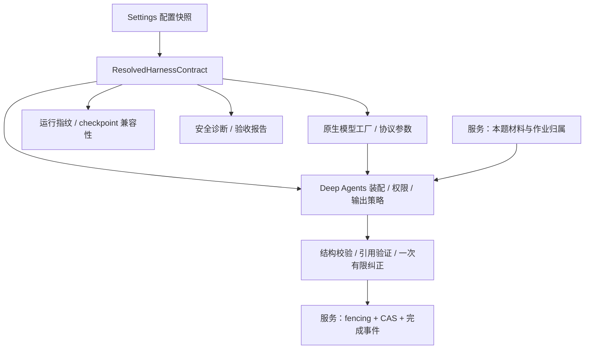

# AI Harness 运行合同设计

状态：已批准（2026-09-08）。基线 `f108fe7`。本设计在 C1/C2 实施验收通过前不代表已完成真实网关验收。

这是父任务共享技术合同。C1 只负责第 8 节能力验证交付；第 2–7 节的生产切换、旧路径删除和最终系统验收统一归 C2。各自工作区、文件所有权和依赖见 [任务映射](task-map.md)，不能把共享设计当作启动父任务实施的指令。

## 1. 设计判断

Deep Agents 本身已经是 Harness。其原生模型—工具循环、文件上下文、权限、摘要和 checkpoint 应继续使用。项目外部工程应让一份运行合同贯穿这些能力，同时将业务权威留在服务与数据库。

此次事故不是“没有一个名字叫 Harness 的类”。模型工厂的协议锁定绕过 SDK 默认值；服务独立计算恢复指纹；适配层丢失错误分类；验证又没有覆盖最终 Agent 请求。修复以这四个可证实缺口为边界。

## 2. 一份合同，现有所有者各司其职

在现有 `ai_runtime` 内新增小型 `contract.py`，定义不可变的 `ResolvedHarnessContract`，由 `DeepAgentRubricGenerator` 的生产装配入口解析并持有。它只保存已解析配置、策略版本和确定性 fingerprint，不构造图、不调用 Provider、不查询数据库；`model.py`、`deep_runtime.py` 和服务通过这个值共享事实，避免循环依赖和另一层执行引擎。

合同至少包含：

- 模型身份：provider、model、规范化 endpoint、实际协议、思考强度（保留“未指定”与显式 `none` 的区别）。
- 结构化输出策略与当前结果 schema hash。
- 版本化的 Harness 策略身份：本题文件/工作区权限、禁用工具/委派、Prompt/材料封装策略、公开流过滤、验证/纠正规则。
- 默认运行预算与有限引用纠正预算；记录本次实际覆盖值，避免脚本宣称使用了未传入的限制。
- 影响消息与恢复格式的 SDK 版本；至少包括 Deep Agents、LangChain/core、provider 集成、LangGraph 和 checkpoint 包。
- Responses 的客户端持有历史策略：`store=false`、不启用 `previous_response_id`、必要的加密推理续传。

合同不包含 API key、数据库凭证、原始材料或私有推理。endpoint 只用于内部身份，诊断输出 endpoint fingerprint，不输出 URL。材料内容继续使用独立 `materials_fingerprint`。

实现约束：

- 正常 Worker、冒烟与真实验收复用同一装配入口；测试可以注入模型/会话，但必须显式携带对应合同，不能拿全局 Settings 给注入模型伪造身份。
- 服务从本次实际 generator 取得合同指纹，删除自行猜测 SDK/model 的 `runtime_fingerprint()` 实现及异常降为 runtime_mode 的逻辑。
- 合同解析不调用模型、不初始化/迁移数据库。模型客户端继续按生成需要惰性构造；清理流程不依赖合同有效或模型可用。
- 每次生成的 counters、sink、锁、连接、纠正状态继续局部持有；不放进进程级 HarnessProfile。

保留“显式构造模型实例，再交给 create_deep_agent”的方式，因为它是官方支持入口，也便于保持本项目 AI_* 凭证/端点合同和隔离测试。改成字符串模型加全局 ProviderProfile 也能配置协议，但并不会自动补足请求组合验证、错误分类和运行指纹，还会把本项目参数耦合进进程级注册；本任务不因此更换配置所有者。

## 3. 协议与参数

增加仅作用于 OpenAI 分支的 `AI_OPENAI_API=responses|chat_completions`。新默认和本次目标配置为 `responses`；`.env.example`、README 同步明确协议要求。原有只支持 Chat 的部署必须显式选择 `chat_completions`，不得再靠隐含默认值或请求失败后的切换。

| 选择 | 模型构造与语义 |
|---|---|
| OpenAI Responses | 原生 `ChatOpenAI(use_responses_api=True)`；思考参数使用 `reasoning={"effort": value}`，未指定则省略 effort；SDK 负责 input、工具和 text.format 转换 |
| OpenAI Chat Completions | 原生 `ChatOpenAI(use_responses_api=False)`；显式思考值传 `reasoning_effort`；只按实际验收通过的组合使用 |
| Anthropic Messages | 保留当前 ChatAnthropic 构造与 Messages 协议；`AI_OPENAI_API` 不传给它；现有思考强度不支持约束保持 |

静态验证负责协议枚举、字段形状、相互冲突的参数和已声明能力一致性；SDK profile 是能力参考，不能证明兼容网关实现。当前目标的真实组合验收才是部署 readiness 证据。已知失败组合进入否定性回归，不能推广成对所有推理模型的协议禁令。

**删除自定义 `OpenAICompatibleChatOpenAI._generate`。** 它固定使用 Chat 客户端及 Chat 解析，不能随 Responses 开关一起保留。同步普通调用、Agent 流式及 Harness 内部摘要调用都回到原生 SDK 协议分发。

保留当前端点确实需要的最小 HTTP 配置（有限 timeout、重试上限、已存在的 telemetry header 清理），通过原生客户端的 HTTP 配置注入；不复制 SDK 的请求构造、流式解析、消息转换或异常映射。headers 的必要性与行为要有真实端点和离线请求证据，不新增无依据的 adapter 包或 monkeypatch。

## 4. 结构化输出、约束与纠正

当前 Luna 的 SDK profile 声明 native structured output，实际 Agent 请求也是原生 JSON Schema；因此目标 Responses 合同明确使用 `ProviderStrategy(RubricGenerationResult)`。第一道真实门必须验证它与当前文件工具同时可用。

原有其它模型/Provider 按当前声明能力在装配时解析一次 Agent 策略，并把实际选择纳入合同；不在每次模型错误后重新选择。确实使用 ToolStrategy 的现行组合仍由 LangChain 处理，强制 tool_choice 的支持也需要验收；本任务不新增“删 tool_choice、改 JSON mode、裸 JSON 解析”等失败旁路。

保持原有七个可见文件工具和权限范围；继续通过精确模型键的 HarnessProfile 排除 `execute`、`task`，关闭默认 general-purpose 子代理，使用 StateBackend。注册是合并式且进程级的，验证的是最终有效工具和限制，不能只断言注册函数执行过。

验证和纠正分层：

1. 协议/配置错误：不进入模型内容纠正，不改参数重发。
2. 原生 schema/解析与工具输入错误：按实际 Agent 策略处理，受同一运行预算约束；不得把未知异常转换成成功结果。
3. 引用与业务规则：复用当前确定性校验、可证实的引用修复及最多一次引用修订，最终由服务检查后提交。
4. 保留当前预算口径（每次生成尝试），不增加新的 retry middleware。SDK 请求重试与 OperationJob attempts 的上限必须在诊断与测试中明确；重试不产生第二个业务结果。

`smoke_ai_provider.py` 当前解析了模型/工具预算参数却未传入生成器；实施将这些已有参数接入同一预算合同，避免验收预算与生产构造脱节，不扩建预算系统。

## 5. Responses 多轮历史与 checkpoint

采用客户端持有完整必要历史的模式：`store=false`、`use_previous_response_id=False`，请求 `include=["reasoning.encrypted_content"]`，不请求或展示推理摘要。

- SDK 产生的消息、function_call/call_id、function_call_output 及 opaque reasoning 数据在内部消息/checkpoint 中原样保留，不手写转换或清空 reasoning 来让下一轮“通过”。
- 公开消息归一化仍独立过滤 reasoning/encrypted_content；内部续传不等于对老师公开推理。
- 继续同步 `stream(stream_mode=[messages, updates, custom], durability="sync")`，不迁移实验性 v3，不维护第二条异步生产路径。
- 合同指纹为确定性 canonical JSON 的散列，包含第 2 节的语义与版本字段。日志路径、进程 PID、attempt 时间不进入指纹。
- 相同合同与材料指纹可按现有 `new / incomplete / complete` 分类恢复；incomplete 用 `inputs=None`；complete 读取已校验结果进行业务提交，不再次调用模型。
- 合同变化走当前服务已有的锁保护不兼容清理与重建流程，先完成清理再登记新指纹；不做旧消息转换、双指纹接受或回填。材料变化的现有重建语义保留。
- 规划与自动验收只操作隔离库；本次原失败题不自动重试。正式环境的切换/重试按运维动作处理，不在导入模块、API 启动或 schema 迁移中批量清理旧检查点。

若网关不支持 `store=false` 下必要的 reasoning 往返，第一道真实门判失败。不得偷偷启用服务端会话存储或丢弃内部历史；返回用户评审兼容性决策。

## 6. 错误分类和诊断

在 ai_runtime 边界集中翻译 LangChain 的标准 `ModelError`，保留 `is_retryable`；生成轮和引用修订轮使用同一翻译路径，保留异常 cause 供受控诊断。

| 分类 | 自动重试 | 对外行为 |
|---|---|---|
| 配置无效 / 400 invalid request / 401 / 403 / 模型 404 | 否 | 题目进入 generation_failed，给出中文配置/鉴权类别说明，材料保留 |
| 429 / 5xx / 连接失败 / 超时 | 按 SDK 与作业既有上限 | 保留技术重试和 checkpoint 连续性 |
| 模型内容或引用错误 | 依既有内容纠正合同 | 有限纠正，最终失败可按业务规则显式重试 |
| 中断/取消/预算终止/未知程序错误 | 不做通用自动重发 | 保留各自既有控制流或安全失败；不能伪装成普通可恢复模型错误 |

Worker 继续拥有 attempt 排队、终态与题目失败投影，不把业务状态管理放进 HarnessProfile。合同解析、模型初始化或请求失败即使发生在 checkpoint 写入之前，也必须留下作业终态和安全失败事件，不能遗留 generating。

保持现有 HTTP `last_error` 的 code/message 形状，通过更准确的机器码与中文模板投影；不向 UI 添加协议切换开关或内部堆栈字段。

运维诊断复用标准库 logging，记录有限结构化字段：时间、operation/question/attempt 关联、合同 fingerprint、模型/协议/强度、异常分类、HTTP status、已知参数类别、可用时的 request_id。当前 400 必须能得到明确的 reasoning 参数兼容性分类。

诊断由 `ai_runtime/diagnostics.py` 中的单一白名单序列化函数处理，使用标准 logging 同时送往现有服务日志与后端 storage 下的 `runtime/ai-diagnostics.jsonl`。路径复用后端现有 storage 定位方式：本地为 `backend/storage/runtime/ai-diagnostics.jsonl`，容器为 `/app/storage/runtime/ai-diagnostics.jsonl`，后者位于已有 appdata 卷；不能直接用 `PROJECT_ROOT`，因为容器扁平打包后的父级不同。文件有限轮转（5 MiB、1 个备份），属 gitignored 运行数据，离线测试写临时目录。无需新增数据库表、LangSmith 账户或外部日志平台。只记录这些白名单字段与应用生成的说明，不记录 raw provider message、材料、headers、完整 URL、raw tools、私有推理或完整 `str(exc)`。未知参数/错误归为 unknown；合同解析失败时 fingerprint 明确记为 unavailable，不以默认模式伪装有效身份。文件写入失败仍向标准错误输出安全诊断，不覆盖原始失败语义。

安全诊断替代后删除 `WORKER_DEBUG_TRACEBACK` 原样打印异常的分支。检查点仍按现有加密策略保存执行状态，但排障不再只依赖解密 checkpoint。

## 7. 切换、删除和回滚

| 删除/替换对象 | 替代与保留边界 |
|---|---|
| OpenAI 分支无条件 use_responses_api=False 及相应默认说明 | 显式协议配置；目标默认 Responses，主动选择的 Chat 仍为现行协议 |
| Chat 专用自定义 `_generate` 类 | 原生 SDK 协议分发；现行必要 HTTP 配置继续注入 |
| 服务自行构造且可退回 runtime_mode 的指纹 | 实际 generator 的同一合同 fingerprint；测试注入也显式给身份 |
| 通用 provider 异常默认 retryable=True 的包装 | 标准异常分类与单一安全翻译，未知异常不默认可重试 |
| WORKER_DEBUG_TRACEBACK 原文打印 | 白名单结构化诊断 |
| 只断言七档值均被发送、所有 OpenAI 请求都走 Chat 的测试假设 | 协议/能力组合和实际 Harness 请求回归；保留真正仍使用的 Chat 模式测试 |
| 当前维护文档里的旧默认/验证说明 | 同步 README、.env.example 和相关 spec；归档 Trellis 任务不重写 |

不新增旧消息/旧指纹转换层；不通过自动 fallback、双写、隐藏模式或兼容开关回滚。回滚依赖已验证 Git 版本和切换前的配置备份；涉及目标环境检查点的恢复使用该环境备份，不靠保留旧运行路径。既有题目和评分项不做数据迁移。

## 8. C1 能力门与 C2 放行条件

由 C1 在隔离资源验证当前端点的完整 Responses 合同，并交付可复跑探针、安全证据和已验证 main 提交。C2 人工核查 C1 完成、能力 PASS 和 main 交付后，才开始生产装配切换。C1 失败时保留请求形状和安全错误类别；如果必须改变模型、存储边界、输出策略或评分项语义，需要更新父子计划并再次审阅。

本门由独立子任务交付，不是规划期已获准调用真实模型，也不是失败后自动降级的许可。C2 必须使 C1 探针最终复用生产装配，删除 C1 为可行性验证暂时拥有的局部模型构造，不留第二份生产合同。
