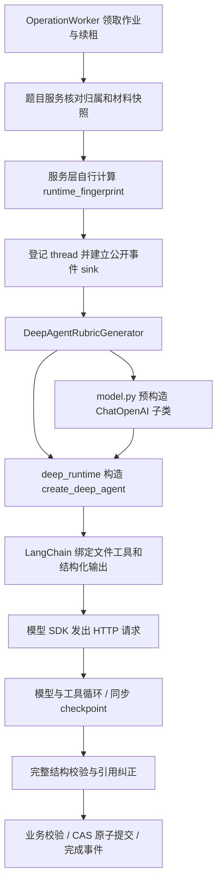

# 事故事实与现有调用链

研究日期：2026-09-08。源码基线：`f108fe7cea2cb7875fa193f1245df29932d035ea`。本文件是规划证据，不是修复或生产验收报告。

## 1. 已证实的故障

同一对话前一轮通过只读事务检查了用户指定题目的业务记录、公开事件和加密检查点中的 `__error__`。只提取错误和控制元数据，没有导出材料、系统提示、私有推理或凭证。

- 配置：`openai`、`gpt-5.6-luna`、`AI_REASONING_EFFORT=medium`。
- 2026-09-08 10:38:40–10:38:42（Asia/Shanghai），同一生成作业尝试 3 次，均在首个模型调用阶段失败，最终为 `generation_failed`。
- 保存的上游错误为 HTTP 400，`type=invalid_request_error`、`param=reasoning_effort`：

> Function tools with reasoning_effort are not supported for gpt-5.6-luna in /v1/chat/completions. To use function tools, use /v1/responses or set reasoning_effort to 'none'.

这证明的是**当前服务端、当前模型、当前协议与参数组合**不兼容，不能推广为“所有 OpenAI 推理模型在 Chat Completions 都不能调用工具”。

前一轮普通对话的真实最小请求成功，只证明无工具请求被接受；新增测试同样只向模型发送 `Reply ok`，没有经过完整 Agent 装配。见 `backend/tests/test_ai_runtime_model.py:28`、`:59`。

## 2. 现有生产链

| 所有者与定位 | 当前事实 | 与本次故障的关系 |
|---|---|---|
| `settings.py:21`、`model.py:146` | 思考强度独立读取并传入模型 | 参数存在不等于完整 Agent 兼容 |
| `model.py:162` | 无论模型为何，OpenAI 分支强制 `use_responses_api=False` | 绕过 SDK 的 OpenAI 默认协议 |
| `model.py:190` | 自定义 `_generate` 固定调用 `self.client.create`，按 Chat 结果解析 | 只翻转协议开关仍可能损坏非流式调用；摘要等内部模型调用也须覆盖 |
| `deep_runtime.py:287`、`:469` | 注册精确模型 HarnessProfile，装配权限、StateBackend、观测 middleware、checkpointer | 已有 Harness 基础；不能误诊为完全没用 Harness |
| `adapters.py:468`、`:502` | 缓存预构造模型，传完整 `RubricGenerationResult` schema | 传入模型实例是 SDK 支持的方式，但 ProviderProfile 的构造默认值不会自动补回来 |
| `adapters.py:547`、`:599` | 生成轮、引用纠正轮的通用异常均包装成默认可重试失败 | 抹掉 SDK 已提供的不可重试语义 |
| `adapters.py:33`、`worker.py:133` | `RubricGenerationFailure.retryable=True` 默认被 Worker 信任 | 同一个错误配置耗尽 3 次 attempt |
| `rubric_generation.py:90` | 服务自行散列模型身份和 Deep Agents 版本；异常时退回 runtime_mode | 缺少协议、思考强度、输出策略、schema 和 Harness 合同身份，也可能掩盖配置错误 |
| `rubric_generation.py:218`、`:236` | 线程登记校验运行/材料指纹；不兼容时沿用清理后重建策略 | 新指纹必须接入这个已有边界，不能直接跨协议恢复旧消息 |
| `deep_runtime.py:756` | 同步 `stream`、`durability="sync"`、恢复用 `inputs=None` | 无需为修复 HTTP 协议重写成第二套异步流 |
| `rubric_generation.py:107`、`:320` | graph 完成仅记阶段，业务 CAS 成功后才发完成事件 | 必须保留的业务权威边界 |

## 3. 根因分层

1. **直接原因：请求组合不被服务端支持。** 需要保留工具和思考强度，因此目标路径是服务端提示的 Responses，实际可用性留待批准后的组合验收。
2. **装配原因：没有同一份已解析运行合同贯穿模型、Harness 和恢复。** 模型工厂、Agent 构造、服务指纹各自推断一部分配置，互相没有验证一致性。
3. **放大原因：错误分类丢失。** 无效请求被当作瞬时错误再次执行；Prompt 自我纠正不能修复服务端拒绝的协议参数。
4. **逃逸原因：验收对象小于生产对象。** 参数传递测试和普通对话成功都没有验证工具、结构化输出、流式和多轮状态组合。

“需要把外部工程纳入 Harness 设计”是有证据支持的判断；具体动作应是统一装配、身份、错误语义和验收入口，不需要另外实现一套模型—工具执行循环。

## 4. 详细日志的真实状态

- 页面消息来自 `adapters.py:549` 的异常类名投影，上游原因没有进入公开消息。
- 前一轮检查时，运行中的 Worker 输出到终端；`storage/runtime/worker.log` 是旧的空文件。
- `worker.py:126` 只有设置 `WORKER_DEBUG_TRACEBACK` 才打印完整堆栈，当前进程未开启；未配置 LangSmith tracing。
- 当前事故可从加密 checkpoint 找到上游错误，但 checkpoint 不是稳定的运维日志接口，清理线程后不能依赖它继续排障。

实施应保留安全的错误分类和可关联诊断字段。不得将完整 `str(exc)`、请求正文、工具参数、材料、模型私有 reasoning 或密钥直接送入公开事件、日志或 UI。

## 5. 既有约束

- 本题材料、工作文件和模型历史保留在线程内；不引入跨题 Store 或宿主机文件访问。
- 业务数据库、OperationJob、checkpointer、公开日志继续分别拥有业务事实、执行租约、运行连续性和老师可读过程。
- `register_harness_profile` 是进程级、合并式注册；继续使用精确模型键和一致的限制，不把每题材料、计数或错误塞入全局 profile。
- 模型初始化仍按生成需要惰性执行，Provider 配置错误不能阻断不调用模型的删除清理作业。
- 当前默认预算是每次生成尝试 24 次模型调用、120 次工具调用、1800 秒；SDK 重试和 OperationJob attempt 各有上限。修复不另加重试 middleware，不改变这些预算为无限循环。
