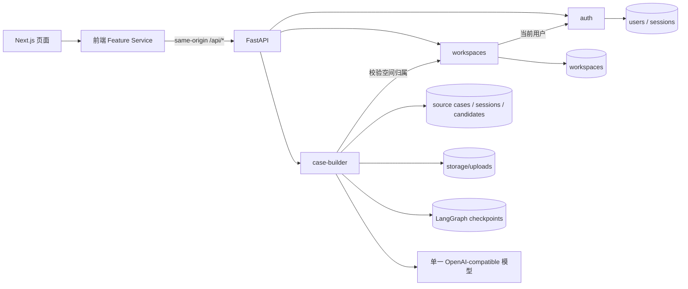

# Walking Skeleton 架构与 Feature 地图

状态：待业务审核

日期：2026-08-28

需求来源：[初始化项目开发规格](./初始化项目开发规格.md)

## 1. 目标和边界

本文件只定义第一条 Walking Skeleton 的技术合同：

```text
登录 → 创建私有场景 → 上传案例 → AI 生成草案
    → 等待人工确认 → 确认并保存候选用例
```

本阶段交付的是可据此实现和验收的边界、接口与状态语义，不是完整前端、数据库或 AI 实现。

明确不进入本次设计：

- `regression-sets`、回归集版本与发布；
- `evaluations`、评测运行、评分和报告；
- 成员邀请、角色分级和共享空间；
- 在线运行 Skill、完整附件格式、精细 UI；
- Worker、任务队列、SSE、WebSocket 和多模型路由。

人工确认只会生成一个 `candidate_case`。它不会自动成为有效回归用例，也不会触发评测。

## 2. 全局 Feature 地图



箭头表示运行时依赖，不表示可以跨 Feature 直接读取 Repository。

| Feature | 负责 | 不负责 | 直接依赖 | 数据归属 |
|---|---|---|---|---|
| `auth` | 注册、登录、退出、当前用户、密码哈希、服务端 Session | 业务资源授权、角色体系、OAuth/JWT | 数据库与通用设置 | `users`、`sessions` |
| `workspaces` | 创建/读取单人私有场景、场景身份与说明、所有者关系、统一归属校验 | 成员、邀请、案例内容、回归集 | `auth` 提供的当前用户 | `workspaces` |
| `case-builder` | 案例上传、附件解析、AI 共创场景摘要/维度/标签/标准草案、单问题追问、人工确认、候选用例保存 | 自动改写空间、正式回归集、评测、Skill 运行、自动发布 | `workspaces` 归属校验；文件、模型、LangGraph 通用适配器 | `source_cases`、`attachments`、`case_builder_sessions`、`candidate_cases` |

### 2.1 依赖规则

- 页面只调用本 Feature 的前端 Service；前端 Service 只调用统一 API Client。
- FastAPI Router 只做 HTTP 转换、认证依赖和输入校验。
- Feature Service 负责状态转换、事务边界和错误映射。
- Repository 只访问自己 Feature 的表。
- `case-builder` 必须调用 `workspaces` Service 校验归属，不能直接查询 `workspaces` 表。
- `workspaces` 只接收 `auth` 解析出的 `current_user`，不读取 Session 表。
- 跨 Feature 可以持有外键，但不能以外键为理由绕过所属 Feature 的 Service。
- FastAPI OpenAPI 是实现后的唯一机器可读接口事实源；前端类型由它生成，不手写第二份 DTO。

## 3. 数据归属与事实源

| 存储 | 内容 | 是否是业务事实源 | 读取边界 |
|---|---|---|---|
| 业务 PostgreSQL 表 | 用户、Session、空间、源案例、外部可见状态、草案投影、候选用例 | 是 | 只能经所属 Feature Service |
| LangGraph PostgreSQL Checkpoint | 节点游标、图状态、暂停值、恢复所需执行上下文 | 否，仅为执行事实源 | 仅 `case-builder` Workflow 适配器 |
| `storage/uploads` | 原始 TXT/Markdown 二进制 | 是，附件材料 | 仅本地文件适配器；数据库只保存服务端生成的相对键和元数据 |

Checkpoint 不能替代业务表。浏览器也不能提交或选择 `thread_id`；服务端为每个 `case_builder_session` 生成一个稳定 UUID 并保存映射。详细理由见 [ADR-0001](./adr/0001-business-state-and-langgraph-checkpoints.md)。

## 4. 运行时边界

```text
Next.js app route
  → frontend/features/<feature>/services
  → frontend/lib/api/client
  → same-origin /api/* rewrite
  → FastAPI feature router
  → feature service
  → repository / parser / workflow adapter
```

- Next.js 不直接访问数据库、不编排 LangGraph、不实现业务授权。
- FastAPI 是唯一业务与数据事实源。
- 上传文件名只作为展示元数据；磁盘键由服务端生成，不能用用户输入拼接路径。
- AI 命令在本阶段采用一次 HTTP 请求内的同步执行，不引入后台 Worker。页面用本地提交态加持久化业务状态表达进度。
- 页面恢复或另一个标签页可通过读取案例详情获得最新状态；本阶段不增加实时推送协议。

## 5. API 通用合同

### 5.1 通用约定

- 基础路径：`/api`。
- ID：服务端生成的 UUID 字符串。
- 时间：UTC ISO 8601 字符串。
- 除上传接口使用 `multipart/form-data` 外，其余请求和响应使用 JSON。
- Session Cookie 名为 `skill_eval_session`，属性至少为 `HttpOnly; SameSite=Lax; Path=/`；`Secure` 由环境配置。
- 所有业务资源接口先校验 Session，再校验空间所有权。
- 未登录返回 `401`；已登录但访问他人资源返回 `403`；不存在返回 `404`。
- 所有非安全方法只接受同源请求；跨源 `Origin` 返回 `403`。本阶段不另建 CSRF Token 流程。

错误统一为：

```json
{
  "error": {
    "code": "MACHINE_READABLE_CODE",
    "message": "可直接展示给用户的简短中文说明",
    "details": {}
  }
}
```

`details` 可省略。响应不得包含堆栈、数据库信息、磁盘绝对路径、模型原始错误或凭证。

### 5.2 通用错误

| HTTP | `code` | 含义 | 前端动作 |
|---|---|---|---|
| 401 | `AUTH_REQUIRED` | 无 Session、Session 失效或过期 | 跳转登录并保留 `returnTo` |
| 403 | `FORBIDDEN` | 已登录，但资源不属于当前用户或请求跨源 | 展示无权访问，不渲染资源数据 |
| 404 | `RESOURCE_NOT_FOUND` | 当前授权范围内资源不存在 | 展示不存在页 |
| 409 | 具体冲突码 | 重复提交、陈旧版本或不允许的状态转换 | 重新读取资源并按最新状态渲染 |
| 422 | `VALIDATION_ERROR` | 字段格式或组合不合法 | 在对应字段展示错误 |
| 500 | `INTERNAL_ERROR` | 无法形成或持久化一致结果 | 展示通用失败；不自动重复写操作 |

解析失败和可控 AI 失败是已经被业务状态机接住的结果，不伪装成 HTTP 500；接口返回最新资源快照，由 `state` 和 `last_error` 表达。只有无法保存一致业务状态时才返回 500。

## 6. `auth` 接口合同

Session 只有 `anonymous` 和 `authenticated` 两种对外状态。服务端过期或撤销 Session 后，下一次请求按 `authenticated → anonymous` 处理并返回 `401`。

`User`：

```json
{
  "id": "uuid",
  "username": "teacher-a",
  "email": "teacher@example.com",
  "created_at": "2026-08-28T08:00:00Z"
}
```

`email` 可以为 `null`。密码永不出现在响应、日志或错误详情中。

### 6.1 `POST /api/auth/register`

- 请求：`{"username":"...","email":"...|null","password":"..."}`。
- 校验：`username` 去除首尾空白后 2–50 字符；合法邮箱可选；密码 8–128 字符。
- 成功：`201`，返回 `{"user": User}` 并创建、写入 Session Cookie；状态 `anonymous → authenticated`。
- 错误：`409 USERNAME_TAKEN`、`409 EMAIL_TAKEN`、`409 ALREADY_AUTHENTICATED`、`422 VALIDATION_ERROR`。

### 6.2 `POST /api/auth/login`

- 请求：`{"identifier":"用户名或邮箱","password":"..."}`。
- 成功：`200`，返回 `{"user": User}` 并创建 Session Cookie；状态 `anonymous → authenticated`。
- 错误：`401 INVALID_CREDENTIALS`、`409 ALREADY_AUTHENTICATED`、`422 VALIDATION_ERROR`。
- 用户不存在和密码错误使用同一个错误，不能暴露账号是否存在。

### 6.3 `POST /api/auth/logout`

- 请求：无 Body。
- 成功：`204`，撤销当前 Session 并清除 Cookie；状态 `authenticated → anonymous`。
- 无 Session 时也返回 `204`，保证重试安全。
- 错误：`403 FORBIDDEN`（跨源请求）、`500 INTERNAL_ERROR`（无法可靠撤销已有 Session）。

### 6.4 `GET /api/auth/me`

- 请求：Session Cookie。
- 成功：`200`，返回 `{"user": User}`；无状态转换。
- 错误：`401 AUTH_REQUIRED`。

## 7. `workspaces` 接口合同

`Workspace`：

```json
{
  "id": "uuid",
  "name": "客户 A 新闻稿",
  "description": "可选说明",
  "visibility": "private",
  "owner_user_id": "uuid",
  "created_at": "2026-08-28T08:10:00Z",
  "updated_at": "2026-08-28T08:10:00Z"
}
```

`visibility` 由服务端固定为 `private`，请求不能覆盖。第一版不定义删除、归档和成员状态。

### 7.1 `POST /api/workspaces`

- 请求：`{"name":"...","description":"...|null"}`。
- 校验：名称去除首尾空白后 1–100 字符；说明最多 2000 字符。
- 成功：`201`，返回 `{"workspace": Workspace}`；状态 `不存在 → private workspace`，所有者为当前用户。
- 错误：`401 AUTH_REQUIRED`、`422 VALIDATION_ERROR`。
- 同一用户允许创建同名空间，本阶段不引入无业务依据的唯一性规则。

### 7.2 `GET /api/workspaces`

- 请求：无参数。
- 成功：`200`，返回 `{"items":[Workspace]}`，只含当前用户空间，按 `created_at` 倒序；无状态转换。
- 错误：`401 AUTH_REQUIRED`。

### 7.3 `GET /api/workspaces/{workspace_id}`

- 请求：路径参数 `workspace_id`。
- 成功：`200`，返回 `{"workspace": Workspace}`；无状态转换。
- 错误：`401 AUTH_REQUIRED`、`403 FORBIDDEN`、`404 RESOURCE_NOT_FOUND`。

## 8. `case-builder` 接口索引

闭环只增加以下 5 个接口，完整字段、错误和状态转换见 [case-builder 技术合同](./features/case-builder.md)：

| 方法 | 路径 | 用途 |
|---|---|---|
| POST | `/api/workspaces/{workspace_id}/cases` | 保存一个源案例并解析 TXT/Markdown |
| GET | `/api/workspaces/{workspace_id}/cases/{case_id}` | 读取页面所需的完整业务快照 |
| POST | `/api/workspaces/{workspace_id}/cases/{case_id}/draft-generation` | 首次生成草案或重试 AI 失败 |
| POST | `/api/workspaces/{workspace_id}/cases/{case_id}/answers` | 回答当前唯一待答问题并恢复同一 Graph thread |
| POST | `/api/workspaces/{workspace_id}/cases/{case_id}/confirmation` | 确认或修改草案并幂等保存候选用例 |

因此，本闭环共 12 个接口：4 个 `auth`、3 个 `workspaces`、5 个 `case-builder`。

## 9. 最小页面流程

| 页面 | 只承担的职责 | 关键接口 |
|---|---|---|
| `/login` | 登录；可切换到注册表单 | `register`、`login`、`me` |
| `/workspaces` | 显示当前用户的空间；内联创建私有空间 | `me`、`GET/POST workspaces` |
| `/workspaces/{workspaceId}/cases/new` | 填标题、可选说明并上传一个 TXT/Markdown | `POST cases` |
| `/workspaces/{workspaceId}/cases/{caseId}` | 展示解析/AI 状态、回答一个问题、编辑并确认草案、显示保存结果 | `GET case` 及 3 个命令接口 |

页面流程固定为：

```text
访问受保护页
  ├─ 401 → /login?returnTo=...
  └─ 已登录 → /workspaces
      → 创建/选择私有空间
      → /cases/new 上传
      → /cases/{caseId} 自动请求生成草案
      ├─ waiting_for_input → 回答 → 继续生成（可循环）
      ├─ waiting_for_confirmation → 编辑/确认
      └─ confirmed → 展示候选用例 ID 和只读快照
```

不增加首页大盘、空间详情大盘、回归集页和评测页。视觉只需能区分状态、错误和可执行的下一步。

所有页面还要遵守最小加载约定：受保护页在 `GET /api/auth/me` 完成前只显示加载态，不能先闪现私有内容；登录、注册、创建空间和上传提交期间禁用重复提交；请求结束后必须以服务端响应为准，不能仅凭前端请求完成就宣布成功。

## 10. 实现前必须保持的约束

- 任何 AI 输出都不能直接进入 `confirmed`。
- 解析为空不能调用模型。
- 一个案例同一时刻只能执行一个 Graph 命令。
- 确认写入候选用例和案例状态必须处于同一数据库事务，并有唯一约束兜底。
- 另一个账号必须无法读取案例、附件、草案、问题、Checkpoint 映射或候选用例。
- 不为未来 Feature 创建空 Router、空表或占位页面。
