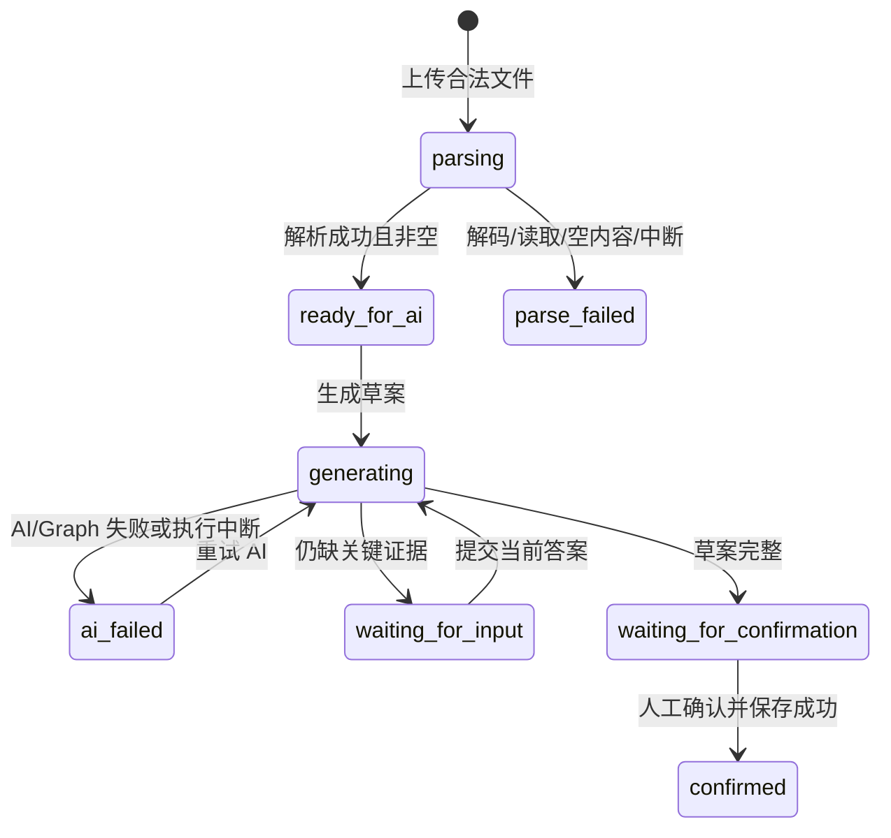

# Case Builder Walking Skeleton 技术合同

状态：待业务审核

日期：2026-08-28

上位架构：[Walking Skeleton 架构与 Feature 地图](../architecture.md)

## 1. 本合同解决什么

`case-builder` 只负责以下闭环：

```text
在自己的私有空间上传源案例
  → 明确完成或失败的解析
  → AI 整理有证据的草案
  → 必要时一次追问一个问题
  → 人工查看并可修改草案
  → 人工确认
  → 保存已确认的候选用例
```

这里的“候选用例”不是正式回归集成员。确认不会创建回归集版本，也不会触发评测。

## 2. Walking Skeleton 的最小取舍

以下取舍是为了形成一条可验证的纵向链路，均需要业务审核：

1. 一个源案例本阶段必须上传且只上传一个 `.txt` 或 `.md` 文件，可额外填写任务说明。
2. 上传请求内同步保存和解析文件；AI 命令也在请求内同步运行，不引入任务队列。
3. 上传成功后，详情页自动触发一次草案生成；后端状态保护负责防止重复运行。
4. AI 可以连续提出多个问题，但任一时刻最多只允许一个待答问题。
5. 只要仍有 `blocking=true` 的证据缺口，就不能进入等待确认或保存候选用例。
6. 人工修改不单独产生“编辑中”版本；点击确认时提交完整修改稿并原子保存。
7. 解析失败的案例保留失败记录，不对同一附件提供无意义的重试；用户修正文件后重新上传。AI 失败允许在原案例、原 `thread_id` 上重试。

## 3. 领域对象和数据归属

| 对象 | 含义 | 最小持久化内容 | 所属 |
|---|---|---|---|
| `SourceCase` | 老师上传、等待共创的原始案例 | 空间、标题、说明和时间 | `case-builder` 业务表 |
| `Attachment` | 一个 TXT/Markdown 材料 | 服务端存储键、原文件名、类型、大小、解析文本/摘要 | `case-builder` 业务表 + 本地文件 |
| `CaseBuilderSession` | 一次案例共创过程，也是 Case Builder 状态的唯一业务来源 | `source_case_id`、内部 `thread_id`、状态、当前问题/草案投影、草案修订号、最后一次恢复标识、错误 | `case-builder` 业务表 |
| `GraphCheckpoint` | LangGraph 恢复执行所需的内部状态 | 节点状态、暂停值、执行游标 | LangGraph Checkpoint 表 |
| `CandidateCase` | 老师确认后的候选用例快照 | 最终内容、来源案例、草案修订号、确认人和确认时间 | `case-builder` 业务表 |

约束：

- 一个 `SourceCase` 恰好对应一个 `CaseBuilderSession` 和一个稳定的内部 `thread_id`。
- `CaseDetail.case.state` 始终来自 `CaseBuilderSession.state`，不在 `SourceCase` 再保存第二份状态。
- 一个 `SourceCase` 最多生成一个 `CandidateCase`；数据库唯一约束必须兜底。
- `thread_id` 由服务端生成并保持少于 255 字符，浏览器既不读取也不提交。
- 对外状态、当前问题、当前草案和最终候选用例以业务表为准；Checkpoint 只负责恢复 Graph。
- 原文件、解析文本、草案、老师回答和候选内容都继承空间所有权，不能跨空间读取。
- `parse_failed` 的 `last_error.retryable` 固定为 `false`；本闭环内的 `ai_failed` 固定为 `true`，由状态而不是前端猜测是否显示重试动作。

## 4. 对外数据结构

### 4.1 `EvidenceRef`

每个事实、判断和标准都应尽量带来源，不能只返回一段没有出处的 AI 结论。

```json
{
  "kind": "attachment_excerpt",
  "source_id": "attachment-or-question-id",
  "locator": "lines 12-18",
  "quote": "原文短摘录"
}
```

| 字段 | 规则 |
|---|---|
| `kind` | `attachment_excerpt`、`task_description` 或 `teacher_answer` |
| `source_id` | 对应附件 ID、源案例 ID 或问题 ID |
| `locator` | 可为空；TXT/Markdown 优先使用行号 |
| `quote` | 可为空；只保存支撑当前条目的必要短摘录 |

### 4.2 `DraftContent`

AI 草案和人工确认稿共用同一结构，避免前后端维护两份语义不同的 DTO：

```json
{
  "scenario": {
    "summary": "本案例所属的业务场景及适用边界",
    "evidence_refs": []
  },
  "task_goal": "这项真实任务最终要完成什么",
  "input_summary": "允许使用的输入材料概述",
  "output_requirements": ["输出格式或必须满足的要求"],
  "prohibited_errors": ["明确禁止出现的错误"],
  "reference_outcome": {
    "accepted_result": "老师认可的完整结果",
    "rationale": "认可或否定原因",
    "evidence_refs": []
  },
  "facts": [
    {
      "id": "fact-1",
      "text": "输入中明确存在的事实",
      "evidence_refs": []
    }
  ],
  "teacher_judgments": [
    {
      "id": "judgment-1",
      "text": "老师明确表达的判断",
      "evidence_refs": []
    }
  ],
  "proposed_standards": [
    {
      "id": "proposal-1",
      "text": "AI 推断、等待老师确认的候选标准",
      "evidence_refs": []
    }
  ],
  "unknowns": [
    {
      "id": "gap-1",
      "text": "当前未知或证据缺口",
      "blocking": false
    }
  ],
  "primary_capability": "这条用例主要保护的能力或失败模式",
  "dimensions": [
    {
      "id": "dimension-1",
      "name": "事实准确性",
      "kind": "hard_gate",
      "criterion": "怎样才算通过",
      "evidence_refs": []
    }
  ],
  "tags": ["新闻稿"]
}
```

规则：

- `dimensions[].kind` 只允许 `hard_gate`、`required_quality`、`diagnostic`。
- `scenario` 是候选用例中的场景摘要，不会反向改写 `Workspace.name/description`；修改空间属于另一条命令合同。
- AI 生成时必须把事实、老师判断、AI 候选标准和未知分开；不能把 `proposed_standards` 伪装成 `facts`。
- AI 生成的事实、老师判断、候选标准和维度必须带至少一个有效 `EvidenceRef`；AI 不能凭空补齐证据。
- `reference_outcome` 在草案阶段可以为 `null`，但此时必须有对应的阻塞缺口。
- 人工确认时，`scenario.summary`、`task_goal`、`reference_outcome`、`primary_capability`、至少一个输出要求、至少一个维度及其判定标准为必填。
- 人工确认时不得存在阻塞缺口；非阻塞未知可以保留，以免把未知伪装成事实。
- 确认保存的是完整 `DraftContent` 快照，并额外记录 `confirmed_by` 和 `confirmed_at`。原有来源分类继续保留，从而知道哪些内容最初来自 AI 建议。

### 4.3 `CaseDetail`

所有 Case Builder 命令均返回同一种页面快照：

```json
{
  "case": {
    "id": "uuid",
    "workspace_id": "uuid",
    "title": "真实新闻稿案例",
    "task_description": "可选补充说明",
    "state": "waiting_for_confirmation",
    "attachment": {
      "id": "uuid",
      "original_name": "case.md",
      "media_type": "text/markdown",
      "size_bytes": 1200
    },
    "builder": {
      "draft_revision": 1,
      "pending_question": null,
      "draft": {},
      "last_error": null
    },
    "candidate_case": null,
    "created_at": "2026-08-28T08:20:00Z",
    "updated_at": "2026-08-28T08:21:00Z"
  }
}
```

`pending_question` 非空时：

```json
{
  "id": "question-uuid",
  "text": "这份案例里，哪一个结果是老师最终认可的？",
  "reason": "缺少参考结果，无法形成可验证的通过条件"
}
```

`last_error` 非空时：

```json
{
  "stage": "ai",
  "code": "MODEL_OUTPUT_INVALID",
  "message": "AI 返回的草案结构不完整，请重试。",
  "retryable": true
}
```

`candidate_case` 非空时：

```json
{
  "id": "uuid",
  "source_case_id": "uuid",
  "draft_revision": 1,
  "content": {},
  "confirmed_by": "user-uuid",
  "confirmed_at": "2026-08-28T08:30:00Z"
}
```

## 5. 业务状态机

API 的 `state` 只允许以下值：

| 状态 | 含义 | 页面允许的主动作 |
|---|---|---|
| `parsing` | 文件已落盘并建立记录，正在解析 | 等待 |
| `parse_failed` | 文件无法解码、读取或解析为空 | 查看原因，修正后重新上传 |
| `ready_for_ai` | 输入已解析，可开始 AI 共创 | 生成草案 |
| `generating` | Graph 正在分析、恢复或整理草案 | 等待 |
| `waiting_for_input` | Graph 暂停，等待一个老师回答 | 提交当前问题答案 |
| `waiting_for_confirmation` | Graph 暂停，草案可人工修改和确认 | 提交完整确认稿 |
| `ai_failed` | 模型调用、结构化输出或 Graph 执行失败 | 使用原 `thread_id` 重试 |
| `confirmed` | 候选用例已原子保存 | 查看只读结果 |

允许的状态转换：



额外规则：

- `parse_failed` 和 `confirmed` 是本闭环内的终态。
- `generating` 期间的重复生成请求只读取当前快照，不能启动第二次运行。
- 进程中断导致遗留 `parsing` 或 `generating` 时，服务启动时分别归一为 `parse_failed/PARSE_INTERRUPTED` 或 `ai_failed/AI_RUN_INTERRUPTED`；执行新命令前也要对超过配置时限的运行做同样的幂等归一。
- 不在图中定义“自动确认”边；只有确认接口可以触发 `waiting_for_confirmation → confirmed`。
- 任意未列出的命令和状态组合返回 `409`，且不改变状态。

## 6. LangGraph 执行合同

### 6.1 图结构

```text
load_inputs
  → analyze_case
  → inspect_evidence
      ├─ 有阻塞缺口 → ask_for_evidence
      │                  → interrupt({type: "question", ...})
      │                  → Command(resume={question_id, answer})
      │                  → analyze_case
      └─ 无阻塞缺口 → prepare_draft
                         → review_draft
                         → interrupt({type: "draft_review", ...})
                         → Command(resume={draft_revision, content})
                         → persist_confirmed_case
                         → END
```

### 6.2 节点责任

| 节点 | 类型 | 责任 | 失败处理 |
|---|---|---|---|
| `load_inputs` | 数据 | 按已授权的 `case_id` 读取解析文本和老师说明 | 数据缺失直接失败，不调用模型 |
| `analyze_case` | LLM | 生成结构化分析，保留四类来源 | 仅对网络/限流做有界重试；最终进入 `ai_failed` |
| `inspect_evidence` | 确定性 | 校验结构、证据引用和阻塞缺口；一次选一个最关键问题 | 校验异常进入 `ai_failed` |
| `ask_for_evidence` | 人工输入 | 首行调用 `interrupt()` 暂停；恢复后记录回答 | 问题 ID 不匹配由 HTTP Service 在调用 Graph 前拒绝 |
| `prepare_draft` | 确定性 | 归一化 `DraftContent` 并递增 `draft_revision` | 结构不完整回到问题分支或失败 |
| `review_draft` | 人工确认 | 首行调用 `interrupt()` 暂停；恢复后接收完整确认稿 | 陈旧修订号由 HTTP Service 拒绝 |
| `persist_confirmed_case` | 业务写入 | 在确认之后幂等写候选用例并更新业务状态 | 同一事务回滚；唯一约束防重复 |

### 6.3 暂停、恢复和投影

- Graph 必须使用 PostgreSQL Checkpointer 编译；每次调用都使用服务端保存的同一个 `thread_id`。
- 首次生成使用普通输入调用 Graph；回答和确认只用 `Command(resume=...)` 恢复。
- AI 失败后的重试使用同一 `thread_id` 从最后一个可靠 Checkpoint 继续，不重新创建会话；如果失败发生在首个 Checkpoint 建立前，则用原始案例输入和同一 `thread_id` 重新开始。
- `interrupt()` 的值和 `resume` 值必须是可 JSON 序列化的简单对象。
- `ask_for_evidence` 和 `review_draft` 在 `interrupt()` 之前不能新增业务记录；节点恢复会从节点开头重跑。
- Graph 返回暂停结果后，Service 把当前问题或草案投影到 `CaseBuilderSession`，供 GET 接口稳定读取。
- `persist_confirmed_case` 位于确认的 `interrupt()` 之后，并通过 `source_case_id` 唯一约束和幂等读取保证网络重试不会生成两条候选用例。
- 本阶段不使用 LangGraph Store；长期业务事实写业务表。

## 7. 接口合同

以下所有接口都先执行：

```text
require_current_user
  → workspaces.assert_owner(workspace_id, current_user.id)
  → case_builder.assert_case_in_workspace(case_id, workspace_id)
```

路径中的 `workspace_id` 和 `case_id` 不能由 Body 覆盖。

### 7.1 `POST /api/workspaces/{workspace_id}/cases`

创建一个源案例、保存材料并同步解析。

请求类型：`multipart/form-data`

| 字段 | 类型 | 必填 | 规则 |
|---|---|---|---|
| `title` | string | 是 | 去除首尾空白后 1–200 字符 |
| `task_description` | string | 否 | 最多 10000 字符 |
| `file` | file | 是 | 恰好一个；`.txt` 或 `.md`；UTF-8/UTF-8 BOM；大小不超过服务端公开配置 |

服务端同时检查扩展名、声明类型和实际可解码内容，不能只相信浏览器 MIME。

成功响应：`201 CaseDetail`。

允许的状态转换：

```text
不存在 → parsing → ready_for_ai
不存在 → parsing → parse_failed
```

已保存但解析失败仍返回 `201`，并带 `state=parse_failed` 和可理解的 `last_error`。这是一个已建立、可追踪的业务资源，不是 500。

错误：

| HTTP | `code` | 是否创建案例 |
|---|---|---|
| 401 | `AUTH_REQUIRED` | 否 |
| 403 | `FORBIDDEN` | 否 |
| 404 | `RESOURCE_NOT_FOUND` | 否 |
| 413 | `FILE_TOO_LARGE` | 否；`details.max_bytes` 给出当前限制 |
| 415 | `UNSUPPORTED_FILE_TYPE` | 否 |
| 422 | `VALIDATION_ERROR` | 否 |
| 500 | `FILE_STORAGE_FAILED` 或 `INTERNAL_ERROR` | 否；不得留下可访问的半成品 |

解析失败码只出现在成功响应的 `last_error`：

- `TEXT_DECODE_FAILED`；
- `PARSED_CONTENT_EMPTY`；
- `FILE_READ_FAILED`；
- `PARSE_INTERRUPTED`。

### 7.2 `GET /api/workspaces/{workspace_id}/cases/{case_id}`

读取详情页所需的完整、已授权业务快照。

- 请求：无 Body。
- 成功：`200 CaseDetail`。
- 允许的状态转换：无；该 GET 接口只读取已经归一的业务状态。
- 错误：`401 AUTH_REQUIRED`、`403 FORBIDDEN`、`404 RESOURCE_NOT_FOUND`。

该接口不得返回原始磁盘路径、内部 `thread_id`、Checkpoint 内容、Prompt、模型原始异常或其他用户的任何标识。

### 7.3 `POST /api/workspaces/{workspace_id}/cases/{case_id}/draft-generation`

首次生成草案，或在 AI 失败后继续同一个 Graph thread。

- 请求：无 Body。
- 前置状态：`ready_for_ai` 或 `ai_failed`。
- 执行前原子转换：`ready_for_ai|ai_failed → generating`。
- 成功：`200 CaseDetail`。
- 可能结果：`waiting_for_input`、`waiting_for_confirmation` 或 `ai_failed`。

如果模型或结构化输出失败，但服务端已成功保存 `ai_failed`，仍返回 `200 CaseDetail`。`last_error` 可为：

- `MODEL_UNAVAILABLE`；
- `MODEL_TIMEOUT`；
- `MODEL_OUTPUT_INVALID`；
- `GRAPH_EXECUTION_FAILED`；
- `AI_RUN_INTERRUPTED`。

这些错误的 `message` 必须经过清洗，`retryable` 明确告诉页面是否显示“重试 AI”。

幂等和冲突：

| 当前状态 | 结果 |
|---|---|
| `generating` | `200` 当前快照，不启动第二次运行 |
| `waiting_for_input` | `409 ANSWER_REQUIRED` |
| `waiting_for_confirmation` | `409 CONFIRMATION_REQUIRED` |
| `parse_failed` | `409 CASE_NOT_READY_FOR_AI` |
| `confirmed` | `409 CASE_ALREADY_CONFIRMED` |
| `parsing` | `409 CASE_NOT_READY_FOR_AI` |

通用错误：`401`、`403`、`404`、`409`、`500`。

### 7.4 `POST /api/workspaces/{workspace_id}/cases/{case_id}/answers`

回答当前唯一问题并用相同 `thread_id` 恢复 Graph。

请求：

```json
{
  "question_id": "question-uuid",
  "answer": "老师的明确回答"
}
```

校验：答案去除首尾空白后 1–10000 字符；`question_id` 必须等于当前待答问题。

- 幂等重试检查先于状态检查；对一个新答案，前置状态必须是 `waiting_for_input`。
- 执行前原子转换：`waiting_for_input → generating`。
- Graph 输入：`Command(resume={"question_id":"...","answer":"..."})`。
- 成功：`200 CaseDetail`。
- 可能结果：再次 `waiting_for_input`、`waiting_for_confirmation` 或 `ai_failed`。

幂等规则：

- 同一个 `question_id` 和完全相同答案的网络重试返回当前 `CaseDetail`，不再次恢复 Graph。
- 已回答的同一个 `question_id` 携带不同答案返回 `409 QUESTION_ALREADY_ANSWERED`。

错误：

| HTTP | `code` | 状态是否改变 |
|---|---|---|
| 401 | `AUTH_REQUIRED` | 否 |
| 403 | `FORBIDDEN` | 否 |
| 404 | `RESOURCE_NOT_FOUND` | 否 |
| 409 | `QUESTION_NOT_PENDING` | 否 |
| 409 | `STALE_QUESTION` | 否；客户端应重新 GET |
| 409 | `QUESTION_ALREADY_ANSWERED` | 否 |
| 422 | `VALIDATION_ERROR` | 否 |
| 500 | `INTERNAL_ERROR` | 若无法形成一致状态则回滚；不得丢失当前问题 |

AI 已接收答案后再失败时，资源进入 `ai_failed`；用户通过草案生成接口重试，不重复提交答案。

### 7.5 `POST /api/workspaces/{workspace_id}/cases/{case_id}/confirmation`

提交当前草案的完整人工修改稿，并原子保存一个候选用例。

请求：

```json
{
  "draft_revision": 1,
  "content": {
    "scenario": {
      "summary": "单一客户的新闻稿撰写与审核",
      "evidence_refs": [
        {
          "kind": "task_description",
          "source_id": "source-case-uuid",
          "locator": null,
          "quote": "为客户完成一篇可交付新闻稿"
        }
      ]
    },
    "task_goal": "完成一篇满足客户 Brief 的新闻稿",
    "input_summary": "客户 Brief 与老师认可结果",
    "output_requirements": ["交付 Markdown 正文"],
    "prohibited_errors": ["不得编造产品参数"],
    "reference_outcome": {
      "accepted_result": "老师认可的最终稿全文",
      "rationale": "事实准确且满足品牌要求",
      "evidence_refs": [
        {
          "kind": "attachment_excerpt",
          "source_id": "attachment-uuid",
          "locator": "lines 20-60",
          "quote": "认可结果的必要摘录"
        }
      ]
    },
    "facts": [],
    "teacher_judgments": [],
    "proposed_standards": [],
    "unknowns": [],
    "primary_capability": "事实准确性",
    "dimensions": [
      {
        "id": "dimension-1",
        "name": "事实准确性",
        "kind": "hard_gate",
        "criterion": "所有产品参数均能在输入材料中找到依据",
        "evidence_refs": [
          {
            "kind": "attachment_excerpt",
            "source_id": "attachment-uuid",
            "locator": "lines 1-12",
            "quote": "产品参数原文"
          }
        ]
      }
    ],
    "tags": ["新闻稿"]
  }
}
```

- 幂等重试检查先于状态检查；对一次新确认，前置状态必须是 `waiting_for_confirmation`。
- `draft_revision` 必须等于当前修订号。
- `content` 必须满足 4.2 的确认完整性规则，且证据引用只能指向本案例附件、说明和本会话问题。
- Graph 输入：`Command(resume={"draft_revision":1,"content":{...}})`。
- 原子结果：创建或读取唯一 `CandidateCase`，并执行 `waiting_for_confirmation → confirmed`。
- 成功：`200 CaseDetail`，其中 `candidate_case` 为数据库实际保存的只读快照。

幂等规则：已成功确认后，只有同一 `draft_revision` 且 `content` 与已保存快照相同时才返回现有候选用例和 `200`。修订号相同但内容不同，或其他确认请求，均返回 `409 CASE_ALREADY_CONFIRMED`。

错误：

| HTTP | `code` | 状态是否改变 |
|---|---|---|
| 401 | `AUTH_REQUIRED` | 否 |
| 403 | `FORBIDDEN` | 否 |
| 404 | `RESOURCE_NOT_FOUND` | 否 |
| 409 | `CONFIRMATION_NOT_PENDING` | 否 |
| 409 | `STALE_DRAFT` | 否；客户端应重新 GET |
| 409 | `CASE_ALREADY_CONFIRMED` | 否 |
| 422 | `CANDIDATE_INCOMPLETE` | 否，继续停留在等待确认 |
| 422 | `INVALID_EVIDENCE_REFERENCE` | 否，继续停留在等待确认 |
| 500 | `CONFIRMATION_PERSIST_FAILED` | 整个事务回滚，仍为等待确认 |

确认失败绝不能出现“案例已 confirmed，但候选用例不存在”或反过来的半成功状态。

## 8. 页面状态合同

### 8.1 前端瞬时状态

以下只是页面本地状态，不写数据库，也不增加后端枚举：

| 瞬时状态 | 展示 | 防重复规则 |
|---|---|---|
| `bootstrapping` | 页面骨架或“正在加载” | 不显示陈旧操作按钮 |
| `uploading` | 上传按钮显示“正在上传并解析” | 禁用再次提交 |
| `starting_generation` | “AI 正在分析” | 禁用生成按钮 |
| `answering` | “正在提交回答” | 禁用问题输入和按钮 |
| `confirming` | “正在确认并保存” | 草案只读，禁用重复确认 |

网络请求结束后必须以服务端返回的 `CaseDetail.state` 覆盖本地推测，不能由前端自行宣布确认成功。

### 8.2 持久化状态与页面行为

| 服务端状态 | 页面必须展示 | 页面不能做 |
|---|---|---|
| `parsing` | 文件名、解析中 | 调 AI |
| `parse_failed` | 明确原因、“修正文件后重新上传” | 把空内容交给 AI、无条件重试同一文件 |
| `ready_for_ai` | “输入已就绪”并自动触发一次生成 | 人工确认 |
| `generating` | AI 分析中；刷新后仍可恢复显示 | 再启动一个运行、提交确认 |
| `waiting_for_input` | 唯一问题、提问原因、答案框 | 同时显示多个问题、绕过问题确认 |
| `waiting_for_confirmation` | 四类来源、未知项、维度和标准；允许编辑完整稿 | 把 AI 草案标为已确认 |
| `ai_failed` | 清洗后的原因和可重试标记 | 展示模型原始错误或凭证 |
| `confirmed` | 候选用例 ID、确认时间、只读最终快照 | 宣称已经加入回归集或已经通过评测 |

### 8.3 登录和越权

- 任一接口返回 `401`：清空前端用户缓存，跳到登录页，并保存当前地址用于登录后返回。
- 返回 `403`：显示“你无权访问这个私有场景或案例”，不尝试用当前页面已有缓存继续渲染内容。
- 返回 `404`：显示资源不存在；不能用另一个工作空间 ID 猜测读取案例。
- 页面直接访问案例详情时，必须先以详情接口结果为准；不能因为 URL 中有 ID 就认为有权限。

## 9. 已知失败与下一步

| 失败 | 业务状态 | 用户下一步 |
|---|---|---|
| 文件类型或大小在接收前不合法 | 不创建案例，HTTP 413/415 | 选择合规文件 |
| 文件解码、读取失败或解析为空 | `parse_failed` | 修正后新建案例 |
| 模型不可用、超时、结构不合法 | `ai_failed` | 原案例上重试 AI |
| AI 判断缺关键证据 | `waiting_for_input` | 回答当前一个问题 |
| 草案已形成但尚未确认 | `waiting_for_confirmation` | 审阅、修改、确认 |
| 草案版本陈旧 | 状态不变，HTTP 409 | 重新读取最新草案 |
| 确认事务失败 | `waiting_for_confirmation` | 安全重试确认 |
| Session 失效 | 资源状态不变，HTTP 401 | 重新登录 |
| 访问他人资源 | 资源状态不变，HTTP 403 | 返回自己的空间列表 |

## 10. 合同级验收场景

实现阶段至少用 Fake Model 和真实 PostgreSQL 验证：

1. TXT/Markdown 正常解析后进入 `ready_for_ai`，随后生成草案。
2. 空文件进入 `parse_failed`，且没有任何模型调用。
3. Fake Model 先提一个问题；回答后用同一内部 `thread_id` 恢复并得到草案。
4. 页面刷新或 FastAPI 重启后，仍能读取当前问题或待确认草案。
5. 模型失败进入 `ai_failed`；重试不创建第二个会话。
6. 两次并发生成只有一次真正调用 Graph。
7. 陈旧问题 ID 和草案修订号均返回 409，业务状态不改变。
8. 确认请求可包含老师修改后的完整内容；保存后状态和候选用例同时存在。
9. 相同确认请求重试仍只有一条候选用例。
10. 第二个账号对空间、案例和确认接口均得到 403，响应不泄露任何内容。

## 11. 明确延后

- 多附件和 TXT/Markdown 以外的解析；
- 草案历史、人工编辑自动保存和多人协同；
- 候选用例列表、停用和版本管理；
- 将候选用例加入回归集；
- 评测运行、评分、版本比较和报告；
- 实时 Token 流、SSE/WebSocket、后台任务和取消运行。

只有 Walking Skeleton 真实跑通且出现业务证据后，才为这些能力补合同。
